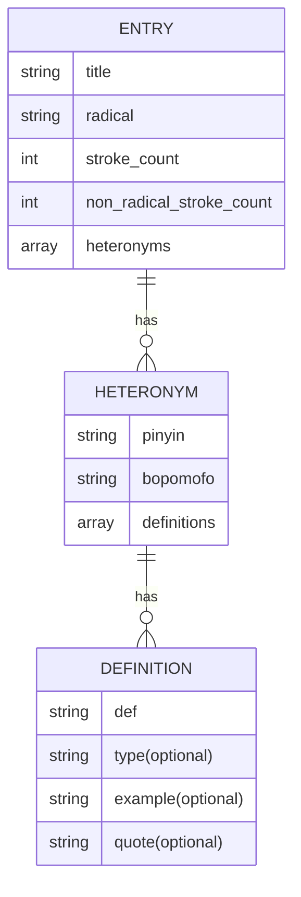
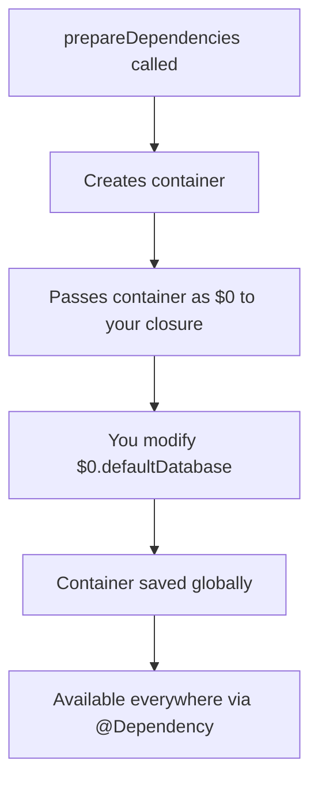
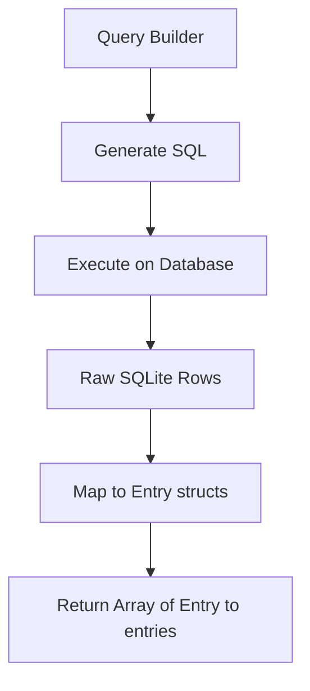
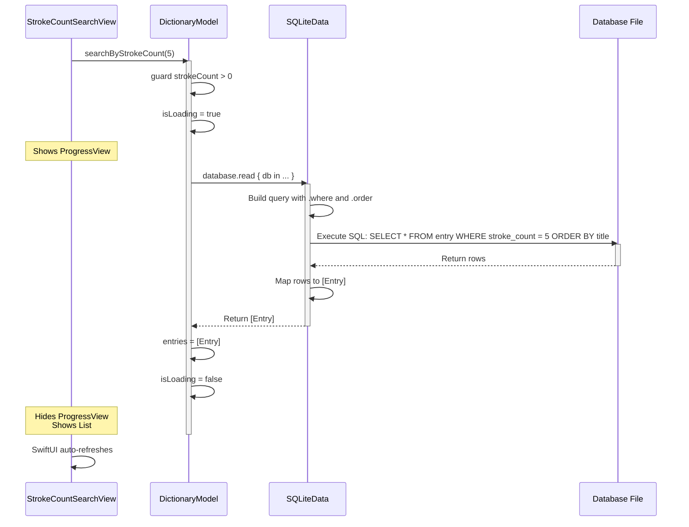
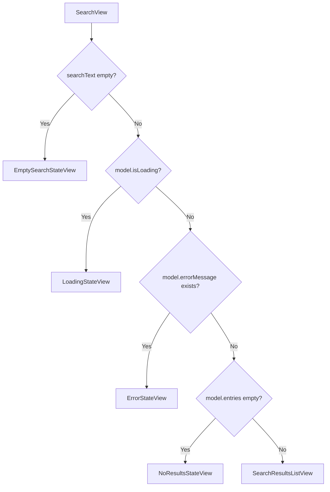

# Building a Mandarin Dictionary

Recently, I had the idea to start building my new app: a Mandarin dictionary specifically for Traditional Mandarin Chinese.

## The Problem with Existing Tools

I have been learning Taiwanese Mandarin for 4 years now as a hobby, using tools like Anki and YouTube, along with some books I got from my Taiwanese friends. I noticed that there aren't many good Mandarin dictionaries available on iOS apart from [Pleco](https://www.pleco.com/). While [Pleco](https://www.pleco.com/) is useful, it is primarily a bilingual dictionary, meaning it translates terms from English to Chinese and vice versa.

I really prefer using monolingual dictionaries. Reading definitions in Chinese (made for native speakers) is a great way of challenging myself and practicing my Chinese skills even more. My only workaround was to use a tool like Gemini, asking it to define a word using Chinese, but I wanted to use a dedicated, real dictionary.

I researched the most popular online dictionaries for Taiwanese Mandarin, and every time I looked it up, one dictionary consistently came up: The MOE Taiwanese Dictionary, published by the Taiwanese Government. I started using their website, but I wanted a native iOS app. Unfortunately, the apps available on the App Store that used this data hadn't been updated in over 10 years.

This led me to want to build a modern application using SwiftUI. Luckily, I found a GitHub repository containing the dictionary data in JSON format and started with the development of the app.

## Understanding the JSON Data and Defining the Schema

To make sure my database could handle the complexity of Chinese dictionary entries, I started by analyzing some entries in the JSON file. One of these entries I analyzed was the character "**行**" (_xíng_, _háng_, etc), which has **multiple readings (heteronyms)**, and each reading can have distinct meanings. This helped me to define the one-to-many relationships for the data.

### Analyzing a Sample Entry

First of all, we import the `json` library in Python and open the dictionary file:

```python
import json

with open("dict-revised.json", encoding="utf-8") as f:
	items = json.load(f)
```

At this point, the variable `items` is a Python object representing the JSON file (a list of dictionaries.)

> [!note] Why UTF-8?
> All files are stored as bytes on disk so to read then we need to decode those bytes. UTF-8 is a common text encoding used to represent all Unicode characters. Without specifying it, Python might use a default encoding which can vary by system and reading non-ASCII characters could produce wrong characters.

Now, let's get some random elements from the middle of the list:

```python
samples = random.sample(items[len(items)//4 : 3*len(items)//4], 3)
```

To understand this line, let's suppose our JSON has 100 entries:

1. `len(items) // 4`: Floor divides 100 (list length) by 4 to get the index $1/4$ into the list. $$ \left\lfloor \frac{100}{4} \right\rfloor = \left\lfloor 25 \right\rfloor = 25 $$
2. `3*len(items)//4`: Multiplies 100 (list length) by 3 and then floor divides by 4 giving the index $3/4$ into the list. $$ \left\lfloor \frac{3 \cdot 100}{4} \right\rfloor = \left\lfloor \frac{300}{4} \right\rfloor = \left\lfloor 75 \right\rfloor = 75 $$
3. Slice `items[start:end]`: In our case the slice is `items[25:75]` which represents a list ranging elements with indexes 25 through 74. (see: slicing)
4. `random.sample(sequence, k)`: Where `k` is the number of elements to get from the `sequence`. In our case, we are getting 3 elements. $$ S = x_{25}, x_{26}, \dots, x_{74} $$ By running this script, we can get three random entries to analyze.

Now, let's try to imagine how each entry structure is going to look like. I will use the character "行" as an example:

```json
{
  "title": "行",
  "radical": "行",
  "stroke_count": 6,
  "non_radical_stroke_count": 0,
  "heteronyms": [
    {
      "pinyin": "xíng",
      "bopomofo": "ㄒㄧㄥˊ",
      "definitions": [
        {
          "type": "動",
          "def": "走、走路。",
          "example": ["直行", "寸步難行", "錦衣夜行"],
          "quote": ["《論語》：「...」", "王維：「...」"]
        },
        { "type": "動", "def": "往。", "quote": ["《詩經》：「...」", "杜甫：「...」"] },
        {
          "type": "動",
          "def": "移動、流動。",
          "example": ["運行"],
          "quote": ["《易經》：「...」", "杜甫：「...」"]
        },
        {
          "type": "動",
          "def": "流通。",
          "example": ["流行", "通行全國"],
          "quote": ["《左傳》：「...」"]
        },
        {
          "type": "動",
          "def": "做、從事。",
          "example": ["行醫", "行善"],
          "quote": ["《左傳》：「...」"]
        },
        { "type": "動", "def": "實施。", "quote": ["《易經》：「...」"] },
        { "type": "動", "def": "經歷。", "quote": ["《聊齋志異》：「...」"] },
        { "type": "動", "def": "可以。", "example": ["行不行？", "行！放手去做吧！"] },
        { "type": "名", "def": "道路。", "quote": ["《詩經》：「...」"] },
        { "type": "名", "def": "行書的簡稱。", "example": ["行草", "行楷"] },
        { "type": "名", "def": "詩體，如〈琵琶行〉。" },
        { "type": "名", "def": "量詞。酌酒單位。", "quote": ["《法言》：「...」"] },
        { "type": "名", "def": "姓。漢有行宏。" },
        { "type": "名", "def": "部首之一。" },
        { "type": "形", "def": "能幹、幹練。", "example": ["你真行。", "他在這方面行得很。"] },
        {
          "type": "副",
          "def": "不久、將要。",
          "example": ["行將就木"],
          "quote": ["元稹：「...」"]
        },
        { "type": "連", "def": "且。", "quote": ["《史記》：「...」"] }
      ]
    },
    {
      "pinyin": "háng",
      "bopomofo": "ㄏㄤˊ",
      "definitions": [
        { "type": "名", "def": "行列。", "quote": ["《左傳》：「...」", "杜甫：「...」"] },
        { "type": "名", "def": "兄弟姐妹次序。", "example": ["排行老三"] },
        {
          "type": "名",
          "def": "量詞。排成的單位。",
          "example": ["一行樹"],
          "quote": ["杜甫：「...」"]
        },
        { "type": "名", "def": "營業機構。", "example": ["銀行", "商行", "分行"] },
        { "type": "名", "def": "職業。", "example": ["各行各業", "行行出狀元"] },
        { "type": "名", "def": "處所，用於人稱後。", "quote": ["周邦彥：「...」"] },
        { "type": "名", "def": "部首之一。" }
      ]
    },
    {
      "pinyin": "xìng",
      "bopomofo": "ㄒㄧㄥˋ",
      "definitions": [
        {
          "type": "名",
          "def": "行為舉止。",
          "example": ["品行", "德行"],
          "quote": ["《論語》：「...」"]
        }
      ]
    },
    {
      "pinyin": "hàng",
      "bopomofo": "ㄏㄤˋ",
      "definitions": [{ "def": "參見「行行」、「樹行子」。" }]
    }
  ]
}
```

Visually, we can imagine a structure like this for each entry:



## Database Implementation: SQLite

Now, we can start defining a relational database schema in SQLite. First, we establish a connection to our database file `dictionary.db`, using Python's `sqlite3` module. The connection object can be seen as an open pipe or session to the database, and the cursor acts as the tool we use to send SQL commands through that connection. We will use it to execute SQL statements like creating tables and inserting data:

```python
import sqlite3

conn = sqlite3.connect("dictionary.db")
cur = conn.cursor()
```

We need three interconnected tables: `entry`, `heteronym`, and `definition`. We can use `cur.executescript` to run these multiple SQL statements at once:

1. `entry` table:

```sql
CREATE TABLE entry (
    id INTEGER PRIMARY KEY AUTOINCREMENT,
    title TEXT,
    radical TEXT,
    stroke_count INTEGER,
    non_radical_stroke_count INTEGER
);
```

2. `heteronym` table: containing the different readings of a character:

```sql
CREATE TABLE heteronym (
    id INTEGER PRIMARY KEY AUTOINCREMENT,
    entry_id INTEGER,
    pinyin TEXT,
    bopomofo TEXT,
    FOREIGN KEY(entry_id) REFERENCES entry(id)
);
```

3. `definition` table: storing the definitions for each reading:

```sql
CREATE TABLE definition (
    id INTEGER PRIMARY KEY AUTOINCREMENT,
    heteronym_id INTEGER,
    type TEXT,
    def TEXT,
    example TEXT,
    quote TEXT,
    FOREIGN KEY (heteronym_id) REFERENCES heteronym(id)
);
```

## Inserting Data into the Database

With the schema already defined, we need to put the data from the JSON file into our SQLite tables:

First, let's open the JSON file using UTF-8 encoding and use `json.load()` to parse the file into a Python object (a list of dictionaries in this case):

```python
with open("dict-revised.json", encoding="utf-8") as f:
    items = json.load(f)
```

Now, we connect to the database and create a cursor to talk to it:

```python
conn = sqlite3.connect("dictionary.db")
cur = conn.cursor()
```

Then, we loop through the list of dictionaries where each dictionary is an entry:

```python
for entry in items:
```

Now, for each entry:

1. `INSERT INTO entry` tells SQLite "I want to add a new row to the table entry".
2. `(title, radical, stroke_count, non_radical_stroke_count)` specifies which columns we are filling in this row.
3. `VALUES (?, ?, ?, ?)` are placeholders for the actual values (it will be filled with the tuple we pass)
4. The tuple of values consists of each of the corresponding columns in the table. It gets the values with the key `"title"`, `radical`, etc from the JSON dictionary entry or `None` if it is missing.

```python
cur.execute(
    "INSERT INTO entry (title, radical, stroke_count, non_radical_stroke_count) VALUES (?, ?, ?, ?)",
    (
        entry.get("title"),
        entry.get("radical"),
        entry.get("stroke_count"),
	    entry.get("non_radical_stroke_count"),
    ),
)
```

### Example

Consider this entry:

```json
{
  "title": "行",
  "radical": "行",
  "stroke_count": 6,
  "non_radical_stroke_count": 0
}
```

Python will run this query:

```python
INSERT INTO entry (title, radical, stroke_count, non_radical_stroke_count)
VALUES ('行', '行', 6, 0);
```

After inserting a row into the table, `lastrowid` stores the auto-increment ID assigned to the entry by SQLite:

```python
entry_id = cur.lastrowid
```

Now, we do the same for the list of `heteronyms` into from each entry:

```python
for het in entry.get("heteronyms", []):
	cur.execute(
		"INSERT INTO heteronym (entry_id, pinyin, bopomofo) VALUES (?, ?, ?)",
		(
			entry_id,
			het.get("pinyin"),
			het.get("bopomofo")
		)
	)
	heteronym_id = cur.lastrowid
```

Now, for the definitions:

1. As `example` and `quote` are lists, we need to convert them into strings as SQL cannot handle them.

```json
["直行", "寸步難行"] → '["直行", "寸步難行"]'
```

2. `json.dumps()` turns the list into a string.
3. `[]` is specified inside the `d.get()` to ensure an empty list is returned if `example` or `quote` are missing instead of `None`.
4. `ensure_ascii=False` is usable to keep the Unicode characters and not ASCII only. So that Chinese characters don't get converted into things like: `\u76f4\u884c`.

```python
for d in het.get("definitions", []):
	cur.execute(
		"INSERT INTO definition (heteronym_id, type, def, example, quote) VALUES (?, ?, ?, ?, ?)",
		(
			heteronym_id,
			d.get("type"),
			d.get("def"),
			json.dumps(d.get("example", []), ensure_ascii=False),
			json.dumps(d.get("quote", []), ensure_ascii=False),
		),
	)
```

Finally, we can commit and close the connection:

1. `commit()` is used to save everything.
2. `close()` is used to close the connection with the database.

```python
conn.commit()
conn.close()
```

## In Swift

Next, we need to prepare the database for use in the SwiftUI app. We create corresponding Swift structs to model our SQLite tables, following the standards of **SQLite Data by Point-Free**.

```swift
@Table("entry")
struct Entry: Identifiable {
    let id: Int
    var title: String
    var radical: String
    @Column("stroke_count")
    var strokeCount: Int
    @Column("non_radical_stroke_count")
    var nonRadicalStrokeCount: Int
}

@Table("heteronym")
struct Heteronym: Identifiable {
    let id: Int
    @Column("entry_id")
    var entryID: Int
    var pinyin: String
    var bopomofo: String
}

@Table("definition")
struct Definition: Identifiable {
    let id: Int
    @Column("heteronym_id")
    var heteronymID: Int
    var type: String
    var def: String
    var example: String
    var quote: String
}
```

> [!important] What are @Table and @Column?
> `@Table` is used to map the struct in Swift to the corresponding table in the database. `@Column` is used when the name of a property into a table in Swift and the database column don't match.

### App.swift

In the app's entry point structure marked with `@main` we can define an initializer and call the `prepareDependencies` function:

1. `prepareDependencies` is a function used to configure global dependencies at the app's entry point.
2. It takes a closure that receives a dependency container (the first parameter `$0`)
3. We use `Bundle.main.path` to retrieve the dictionary database file's path and assign it to the `dbPath` variable. We force unwrap it here because the results of `Bundle.main.path` is optional as the file may not exist. But in our case, the dictionary file is crucial for the app so if it cannot be opened the app will just crash.

```swift
prepareDependencies {
	let dbPath = Bundle.main.path(forResource: "dictionary", ofType: "db")!
	let db = try DatabaseQueue(path: dbPath)
	$0.defaultDatabase = db // defines the default database to the container
}
```

> [!note] What is `DatabaseQueue()`?
> By executing the following line, we are:
>
> 1. Creating a database connection to the file at `dbPath`.
> 2. Creating a serial dispatch queue to ensure that **all database operations happen one at a time.**
> 3. It is a throwing function so it must be marked with `try`. It can throw an error in case of corrupted file, not existing file or insufficient permissions.
>
> ```swift
> let db = try DatabaseQueue(path: dbPath)
> ```

It works like the following:



### ViewModel: Search by Stroke Count Functionality

To communicate between the UI and the database, we create a `DictionaryModel` class, which will serve as our ViewModel:

```swift
@Observable
class DictionaryModel {

}
```

> [!important] What is `@Observable`?
> `@Observable` is a Swift macro (introduced in iOS 17+) that automatically makes all properties of this class **observable**. Before it, we would have to conform the model to `ObservableObject` and mark each of the changing properties with `@Published`.

> [!info] Why a class?
> Because all views should share the same instance.

Inside the ViewModel, we are going to declare a variable to represent the connection to the database and tell SwiftUI to ignore changes to this property as the database connection itself doesn't need to trigger view updates:

```swift
@ObservationIgnored
@Dependency(\.defaultDatabase) var database
```

> [!important] What is `@Dependency`?
> `@Dependency` is a property wrapper from the Dependencies library. It uses a key path syntax `\.defaultDatabase` to access the database we configured in `App.swift`. This is called Dependency Injection which means that we are not creating our own database connection but receiving it from outside.

```mermaid
graph LR
    A[App.swift<br/>prepareDependencies] --> B[Sets defaultDatabase]
    B --> C[Dependency Container]
    C --> D[@Dependency injects it here]
    D --> E[DictionaryModel uses it]

```

### Other Properties

```swift
var entries: [Entry] = []
var isLoading = false
var errorMessage: String?
```

Where:

- `entries`: Is an array of search results. When it changes, any SwiftUI view observing it will refresh.
- `isLoading`: Tracks whether a search is currently in progress. It is used in the UI to show a loading spinner.
- `errorMessage`: Optional string to hold error messages. It is `nil` when everything is fine.

### Asynchronous Database Query

The `searchByStrokeCount` function handles the search logic. It first performs input validation using a `guard` statement, ensuring the `strokeCount` is a valid positive number:

```swift
func searchByStrokeCount(_ strokeCount: Int) async {
	guard strokeCount > 0 else {
		entries = []
		return
	}
}
```

1. `isLoading`: Sets the loading flag before starting the query. It triggers the UI thanks to `@Observable` that makes the view update automatically to show the ProgressView with the text `"搜尋中..."`
2. `errorMessage = nil` means there are no error messages.

```swift
isLoading = true
errorMessage = nil
```

### The Database Query

1. We start a `do-catch` block for error handling. Here, any throwing operation inside can be caught.
2. `database.read` opens a read-only database transaction.
3. This operation can throw an error so it is marked with `try`
4. `await` signals it is an asynchronous operation meaning that the function suspends here while waiting for the database.
5. `db` is the database connection handle.
6. `try Entry` starts building a query on the `Entry` table
7. `.where` adds a filter condition like SQL's `WHERE` clause
8. Here, `$0` represents an entry object.
9. `.order` is similar to SQL `ORDER BY`. Here, we are accessing the `.\title` key path to the title property.
10. `.fetchAll` actually runs the query.
11. We catch all possible errors and display a localized error message.

```swift
do {
	entries = try await database.read { db in
		try Entry
			.where { $0.strokeCount == strokeCount }
			.order(by: \.title)
			.fetchAll(db)
	}
catch {
	errorMessage = "搜尋失敗: \(error.localizedDescription)"
entries = []
}
```

What `fetchAll` is doing here:



After finishing the query, we set `isLoading` to false:

```swift
isLoading = false
```

Visually:



## Views

Let's start with a tab view. A tab view is just an interface that appears at the bottom of most iOS apps, and it helps us to display navigation and action buttons. Here, we will start with just two simple pages: the home screen view and the search view.

```swift
struct TabViewSearch: View {
    var body: some View {
        TabView {
            Tab("首頁", systemImage: "house") {
                HomeView()
            }

            Tab(role: .search) {
                SearchView()
            }
        }
    }
}
```

> [!important] What is `Tab(role: .search)`?
> A special tab designed for searching things into your app. Here, the magnifying glass icon is automatically provided.

For the home view, I just implemented a dummy view for the moment:


Let's start building the `SearchView()` for searching by stroke count. Here, we are going to use a pattern of having one main view switching between different states. Let's start by defining some `@State` variables:

1. `model` holds the `ViewModel` instance to communicate with the model/data
2. `searchText` stores what the user types in the search bar

```swift
struct SearchView: View {
    @State private var model = DictionaryModel()
    @State private var searchText = ""

    var body: some View {
        // ...
    }
}
```

Inside the body, let's add a `NavigationStack`:

```swift
var body: some View {
	NavigationStack {
		...
	}
}
```

> [!important] Why use NavigationStack?
> `NavigationStack` gives us the ability to navigate between different screens (as a stack of views) and also gives us the possibility to use the navigation bar at the top.

We also have to add a `Group` here to be able to build a conditional view:

```swift
Group {
    if searchText.isEmpty {
        EmptySearchStateView()
    } else if model.isLoading {
        LoadingStateView()
    } else if let error = model.errorMessage {
        ErrorStateView(errorMessage: error)
    } else if model.entries.isEmpty {
        NoResultsStateView(searchText: searchText)
    } else {
        SearchResultsListView(entries: model.entries)
    }
}
```

> [!important] What is a Group?
> It is a transparent container (like a `VStack`) but that does not add any visual styling.

### The Search Interface State Machine



### State 1: No search input


```swift
if searchText.isEmpty {
    EmptySearchStateView()
}
```

```swift
struct EmptySearchStateView: View {
    var body: some View {
        ContentUnavailableView(
            "開始搜尋",
            systemImage: "magnifyingglass",
            description: Text("輸入筆畫數以搜尋字詞")
        )
    }
}
```

> [!note] What is ContentUnavailableView()?
> A built-in view to display empty states. It displays a custom centered icon with a title and a description.

### State 2: Database query in progress


```swift
else if model.isLoading {
    LoadingStateView()
}
```

```swift
struct LoadingStateView: View {
    var body: some View {
        ProgressView("搜尋中...")
    }
}
```

> [!note] What is ProgressView()?
> A built-in view for displaying a loading indicator (a spinner)

### State 3: An error occurred


```swift
else if let error = model.errorMessage {
    ErrorStateView(errorMessage: error)
}
```

```swift
struct ErrorStateView: View {
    let errorMessage: String

    var body: some View {
        ContentUnavailableView {
            Label("搜尋錯誤", systemImage: "exclamationmark.triangle")
        } description: {
            Text(errorMessage)
        }
    }
}
```

### State 4: Search completed but no results found


```swift
else if model.entries.isEmpty {
    NoResultsStateView(searchText: searchText)
}
```

```swift
struct NoResultsStateView: View {
    let searchText: String

    var body: some View {
        ContentUnavailableView(
            "無搜尋結果",
            systemImage: "magnifyingglass",
            description: Text("找不到 \(searchText) 畫的字")
        )
    }
}
```

### State 5: Search completed with results


```swift
else {
    SearchResultsListView(entries: model.entries)
}
```

```swift
struct SearchResultsListView: View {
    let entries: [Entry]

    var body: some View {
        List(entries) { entry in
            NavigationLink {
                CharacterDetailView(entry: entry)
            } label: {
                CharacterListRow(entry: entry)
            }
        }
    }
}
```

Here, the `CharacterListRow` represents each item of the list that appears in the search results:

```swift
struct CharacterListRow: View {
    let entry: Entry

    var body: some View {
        HStack {
            Text(entry.title)
                .font(.title)
                .fontWeight(.bold)

            Spacer()

            VStack(alignment: .trailing) {
                Text("部首: \(entry.radical)")
                    .font(.caption)
                    .foregroundColor(.secondary)
                Text("\(entry.strokeCount) 畫")
                    .font(.caption)
                    .foregroundColor(.secondary)
            }
        }
        .padding(.vertical, 4)
    }
}
```

### The character detail view


Here, the `GroupBox` is used to create a section in the view that visually groups some content.

```swift
struct CharacterDetailView: View {
    let entry: Entry

    var body: some View {
        ScrollView {
            VStack(spacing: 24) {
                Text(entry.title)
                    .font(.system(size: 120))
                    .fontWeight(.medium)
                    .padding()

                GroupBox {
                    VStack(spacing: 16) {
                        InfoRow(label: "部首", value: entry.radical)
                        Divider()
                        InfoRow(label: "總筆畫", value: "\(entry.strokeCount)")
                        Divider()
                        InfoRow(label: "部首外筆畫", value: "\(entry.nonRadicalStrokeCount)")
                    }
                    .padding()
                }
                .padding(.horizontal)
            }
            .padding()
        }
        .navigationTitle("字詞詳情")
        .navigationBarTitleDisplayMode(.inline)
    }
}
```

### View Modifiers

After the group containing the conditional views, we are going to chain some view modifiers.

The first one is the navigation title:

```swift
.navigationTitle("筆畫搜尋")
```

Then, we need to add the search bar to the navigation view. To achieve that, we need to add the `searchable` modifier passing the `searchText` with the `$` syntax to create a two-way binding between the search bar text and the variable marked with `@State`:

```swift
.searchable(text: $searchText, prompt: "輸入筆畫數")
```

Then, we apply another modifier to limit the keyboard to use the numeric keyboard since we are searching by stroke count in this demo:

```swift
.keyboardType(.numberPad)
```

Now, we will apply the reactive logic that connects the UI to the view model:

1. `.onChange(of: searchText)`: watches for changes to `searchText`
2. `{ _, newValue in }`: is the way of writing parameters to a closure. The first parameter (oldValue) is ignored. The second parameter (newValue) is the updated search text
3. `Task`: Creates an asynchronous context (needed for `await`)
4. `if let count = Int(newValue)`: tries to convert the `newValue` (the text the user entered) to an integer and if it is successful and the value (now called `count` after the cast) is greater than zero, the search is triggered by `await model.searchByStrokeCount(count)`
5. Else, the results are cleared.

```swift
.onChange(of: searchText) { _, newValue in
    Task {
        if let count = Int(newValue), count > 0 {
            await model.searchByStrokeCount(count)
        } else if newValue.isEmpty {
            model.entries = []
            model.errorMessage = nil
        }
    }
}
```

```mermaid
sequenceDiagram
    participant User
    participant SearchBar
    participant searchText @State
    participant onChange
    participant DictionaryModel
    participant View

    User->>SearchBar: Types "5"
    SearchBar->>searchText @State: Updates value to "5"
    searchText @State->>onChange: Triggers with newValue="5"
    onChange->>onChange: Converts to Int(5)
    onChange->>DictionaryModel: await searchByStrokeCount(5)
    DictionaryModel->>DictionaryModel: isLoading = true
    DictionaryModel->>View: SwiftUI detects change
    View->>View: Shows LoadingStateView
    DictionaryModel->>DictionaryModel: entries = [results]
    DictionaryModel->>DictionaryModel: isLoading = false
    DictionaryModel->>View: SwiftUI detects change
    View->>View: Shows SearchResultsListView
```
