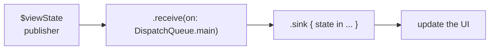
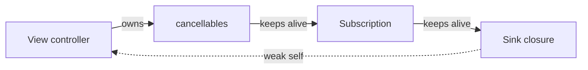
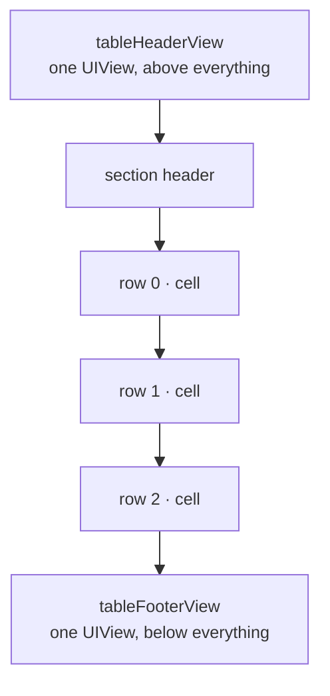
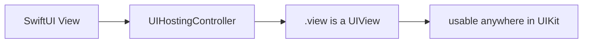

# Six Weeks Building at LINE

In August 2026, I joined LY Corporation through its six-week [SWE-6-55](https://www.lycorp.co.jp/ja/recruit/newgrads/internship/detail/SWE-6-55/) software engineering internship. The position focused on iOS and Android feature development and bug fixes for stickers and emoji in [LINE](https://www.lycorp.co.jp/ja/service/), a communication app for messages, voice calls, and video calls that also connects people with services, businesses, and information. By March 2026, LINE had [100 million monthly active users in Japan, equivalent to 81.3% of the country's population](https://www.lycorp.co.jp/ja/company/global). Working on a product embedded in daily life at that scale made even small interface changes feel consequential.

## Traveling to Fukuoka for My First Day

My internship started with a trip from Tokyo to Fukuoka. I live in Tokyo, but the **iOS** team I joined was based in Fukuoka.

<figure style="margin: 0;">
  <div style="display: flex; gap: 1rem; flex-wrap: wrap;">
    <div style="flex: 1 1 0; min-width: 12rem;">
      
    </div>
    <div style="flex: 1 1 0; min-width: 12rem;">
      
    </div>
  </div>
  <figcaption style="margin-top: 0.6rem; color: var(--gray); font-size: 0.82rem; line-height: 1.5; text-align: center;">Haneda to Hakata, one evening before my first day at LINE.</figcaption>
</figure>

I spent only one day in Fukuoka, at the very beginning. That day was focused on completing the onboarding and setting up my development environment so that I could continue working from Tokyo.

<figure style="margin: 0;">
  <div style="display: flex; gap: 1rem; flex-wrap: wrap;">
    <div style="flex: 1 1 0; min-width: 12rem;">
      
    </div>
    <div style="flex: 1 1 0; min-width: 12rem;">
      
    </div>
  </div>
  <figcaption style="margin-top: 0.6rem; color: var(--gray); font-size: 0.82rem; line-height: 1.5; text-align: center;">Coffee in hand and ready to head to the office for my first day.</figcaption>
</figure>

After that I returned home, and the following week I began working on my first task.

## What I Worked On

I joined the division responsible for **stickers**, **emoji**, and **coins**. Over six weeks I worked on three tasks:

| Task                                   | Area            | Work            |
| -------------------------------------- | --------------- | --------------- |
| Updating the **Download all** button   | Stickers, Emoji | A design update |
| Fixing the language settings layout    | Stickers        | A bug fix       |
| Rewriting a screen's footer in SwiftUI | Coins           | A rewrite       |

I was working **14 hours a week**. As an international student in Japan, I needed to keep my combined working hours within my 28-hour weekly limit, and I was dividing that time between LINE and another internship.

## Updating the Download All Button

My first task was part of LINE's update for **Liquid Glass**, the translucent, light-refracting material Apple introduced in iOS 26. I refer to the app's Liquid Glass appearance as **the new design** throughout this post; it is only ever active on iOS 26 and above. In the sticker section of LINE's settings there is a **My Stickers** screen where users can see what they own. It has two tabs, **Stickers** and **Emoji**, and each tab has a large **Download all** button at the bottom that downloads everything at once. The two tabs are built by two separate view controllers, which is why this task ended up touching _two_ files.

<figure style="margin: 1.5rem 0;">
  
  <figcaption style="margin-top: 0.6rem; color: var(--gray); font-size: 0.82rem; line-height: 1.5; text-align: center;">The original Download all button on the Stickers and Emoji tabs.</figcaption>
</figure>

My mentor sent me a JIRA ticket containing a reference image from the designer. The image showed how the button should ideally look after the update, and my first step was to understand how to reproduce that appearance in **UIKit**.

After looking into the available APIs, I found Apple's [`UIButton.Configuration.prominentGlass()`](<https://developer.apple.com/documentation/uikit/uibutton/configuration-swift.struct/prominentglass()>), which creates a button configuration with a prominent Liquid Glass style.

### Finding the Button in the Codebase

Before changing the appearance, I had to find the code responsible for the button. This was my first time working in LINE's codebase. Even though I knew exactly which button I was looking at in the app, finding its implementation and understanding how it was connected to the screen took some exploration.

I used AI tools to help identify the relevant files and explain the surrounding code. Once I had a likely candidate, I wanted to verify that modifying it would affect the button I was seeing in the app. For that, I started with a small experiment: **changing its color**. From there, I looked more closely at how the button was created, added to the screen, and connected to its behavior. I also discussed my understanding with my mentor. Breaking the exploration into **smaller steps** helped me move forward without needing to understand the entire codebase first.

### Building a Liquid Glass Prototype

My next step was to create a new button and connect it in place of the existing one. Before spending more time on its appearance, I wanted to understand how replacing the component would work.

That experiment was successful as well. My own button appeared in the app, and I connected it to the existing tap handler. Once that was working, I applied the prominent Liquid Glass configuration.

The effect was working, but the colors were still the API's defaults, not LINE's. I used the configuration's `baseBackgroundColor` and `baseForegroundColor` properties to set the base colors to green and white. These properties provide the colors that the button configuration uses as the _starting point_ for its background and foreground appearance ([Apple Developer](https://developer.apple.com/documentation/uikit/uibutton/configuration-swift.struct)).

I also adjusted the area surrounding the button. The original button sat above a solid background that appeared white or black depending on the app's appearance. For the prototype, I made that container transparent:

```swift
buttonContainer.backgroundColor = .clear
```

This removed the solid background behind the button while keeping the button's own glass appearance. The result was a green button floating above the content:

<figure style="margin: 1.5rem 0;">
  
  <figcaption style="margin-top: 0.6rem; color: var(--gray); font-size: 0.82rem; line-height: 1.5; text-align: center;">The first Liquid Glass prototype, followed by the version using LINE's colors and a clear surrounding background.</figcaption>
</figure>

The prototype was only used when the new design was enabled. I also updated the configuration for the _ready-to-download_ and _downloading_ states, since the button needed to switch between offering a download and allowing the user to cancel it.

At this point, I had a working prototype inside the actual screen. However, comparing it with the design reference revealed a difference that was not as straightforward to resolve as the background color.

### Discussing the Text Color with the Design Team

The design showed **solid white** text inside the button. In my build, the title came out softer, blending into the button's material instead of sitting on top of it as opaque white. It is visible in the screenshot above: "Download all (10)" reads as translucent against the green.

The relevant configuration looked like this:

```swift
var configuration = UIButton.Configuration.prominentGlass()

configuration.baseBackgroundColor = brandGreen
configuration.baseForegroundColor = brandWhite

let prominentWhite = brandWhite.withProminence(.primary)

configuration.titleTextAttributesTransformer = .init { attributes in
    var attributes = attributes
    attributes.font = buttonFont
    attributes.foregroundColor = prominentWhite
    return attributes
}

button.configuration = configuration
```

Even with a white `baseForegroundColor`, an explicit `titleTextAttributesTransformer`, and `.primary` prominence, the text still did not look like the solid white in the design. I also tried adding a separate `UILabel` on top of the button, so that the title would bypass the configuration entirely. That did not produce solid white either, so I stopped there.

Adjusting the implementation further without knowing which result the designers preferred did not seem useful, so I shared the difference with the design team. I explained what I had tried and showed how the button appeared in the app.

I enjoyed this part of the task because I had the chance to discuss the implementation directly with the people responsible for the design. Having a working prototype made the conversation more specific. We could compare the reference with the result on the screen and consider whether the difference was acceptable or whether we should take another approach.

The designers needed some time to consider it. The following week they came back with a different direction: keep the existing non-Liquid Glass button, and change only its **corner radius** to make it capsule-shaped.

### Returning to the Existing Button

Following that decision, I returned to the existing button. Its height was already defined as a layout constant of **48 points**, and a capsule is just a rectangle whose corner radius is half its height:

$$
\frac{48}{2} = 24 \text{ pt}
$$

I did not write `24` directly. I derived it:

```swift
private enum Design {
    static let downloadButtonHeight: CGFloat = 48
    static let downloadButtonCornerRadius: CGFloat =
        downloadButtonHeight / 2
}
```

Deriving the value keeps the relationship between the height and the radius explicit, so the two cannot drift apart if the height ever changes.

I then applied that value to the button's layer. A layer's [`cornerRadius`](https://developer.apple.com/documentation/quartzcore/calayer/cornerradius) property controls the rounding of its background and border.

```swift
if !isNewDesignEnabled {
    button.styleKey = .solidStyle
} else {
    button.layer.cornerRadius = Design.downloadButtonCornerRadius
}
```

Here `isNewDesignEnabled` stands in for the existing condition for the new design, and `styleKey` and `.solidStyle` for the existing styling property and the value it was already being given. The condition and its first branch were _already there_; my change added only the `else` branch, leaving the original styling untouched.

I also carried one thing over from the prototype: the transparent container behind the button. The design files showed that area without a solid background, so I kept that part of the change and flagged it in the pull request. It came back as the second review comment.

<figure style="margin: 1.5rem 0;">
  
  <figcaption style="margin-top: 0.6rem; color: var(--gray); font-size: 0.82rem; line-height: 1.5; text-align: center;">The final capsule-shaped Download all button on the Stickers and Emoji tabs.</figcaption>
</figure>

### Preparing the Download All Pull Request

In the pull request, I explained both the implementation and _why_ it differed from the original plan. Since the ticket had started with a prominent Liquid Glass design, I wanted someone reading the pull request to understand why the final change only adjusted the corner radius.

Because the button exists on both tabs of the screen, and because it looks different again once there is nothing left to download, I included screenshots of all three appearances on each tab.

**Stickers**

<figure style="margin: 1.5rem 0;">
  
  <figcaption style="margin-top: 0.6rem; color: var(--gray); font-size: 0.82rem; line-height: 1.5; text-align: center;">The Stickers tab in its available, downloading, and fully downloaded states.</figcaption>
</figure>

**Emoji**

<figure style="margin: 1.5rem 0;">
  
  <figcaption style="margin-top: 0.6rem; color: var(--gray); font-size: 0.82rem; line-height: 1.5; text-align: center;">The Emoji tab in its available, downloading, and fully downloaded states.</figcaption>
</figure>

I did not add new unit tests for this change. The pull request documented the visual states to check and made it clear that _both_ tabs needed to be verified.

### Navigating the Review

After submitting the pull request, I received three comments from reviewers.

**The first** came from my mentor, who suggested using [`UIButton.Configuration.CornerStyle.capsule`](https://developer.apple.com/documentation/uikit/uibutton/configuration-swift.struct/cornerstyle-swift.enum) instead of setting `cornerRadius` directly on the button's layer. I looked into it, but concluded that it would not work here. The existing button component was not styling itself through `UIButton.Configuration`: it sets its own corner radius and content insets directly in its initializer, and nothing in the style it was being given assigns a configuration. It does have an optional configuration-based appearance path, but that is off by default and was not turned on for this button. Introducing `CornerStyle.capsule` would mean fighting the way the component already configures its appearance. My mentor agreed with the reasoning, and the comment was resolved.

**The second** comment concerned a change I had included alongside the `cornerRadius` update. I had set the background of the button container to `.clear`, drawing that inference from the design files. A reviewer noted that the designer had not explicitly requested it. I explained my reasoning and attached screenshots from the design reference to show where I had drawn the inference. Since the files showed the area both with and without transparency, I followed up with the designer directly. They wanted the background to stay opaque for now, so I reverted the change and updated the pull request screenshots.

**The third** comment asked whether the `cornerRadius` update should apply to all iOS versions or only iOS 26. I confirmed with the designer: only **iOS 26 and above**.

### What the First Task Taught Me

The merged pull request ended up adding **eight lines across two files**. Looking only at that diff, it would be difficult to see how much exploration had happened before it.

I had used AI to help navigate unfamiliar code, checked my understanding through small experiments, replaced an existing component with a prototype, and discussed a visual difference with the design team. Although the prototype was not the final implementation, it was what let us evaluate the original direction and decide how to proceed.

The task also shaped how I wanted to use AI in an unfamiliar project. It helped me find relevant code and form an initial understanding, but changing the button's color, running the app, and talking through the implementation with my mentor were what let me _verify_ that understanding.

## Fixing the Language Settings Layout

My second task stayed in the same corner of the app, but this time it was a bug fix. When the new design was enabled, the toggle switches in the sticker auto-suggestion language list sat noticeably closer to the right edge of the screen than the switches on other settings screens.

<figure style="margin: 1.5rem 0;">
  
  <figcaption style="margin-top: 0.6rem; color: var(--gray); font-size: 0.82rem; line-height: 1.5; text-align: center;">A correctly aligned settings screen beside the language screen that exposed the right-edge bug.</figcaption>
</figure>

Comparing the two, the right edge is the difference that got the bug filed, but the rows in the language screen also start slightly further from the _left_ edge. That second detail turned out to matter.

After looking at the layout, I found **three separate problems** behind that one symptom. Each fix had a different job:

| Fix                                  | Problem                                                                 | Role                               |
| ------------------------------------ | ----------------------------------------------------------------------- | ---------------------------------- |
| Remove the 44-point width constraint | The iOS 26 switch needed more room than the cell reserved               | Correct the switch's layout size   |
| Use the shared 16-point padding      | This row used a different margin from comparable settings rows          | Put the whole row on the same grid |
| Add the 4-point trailing adjustment  | The switch's scale transform created invisible space around its artwork | Align the switch's visible edge    |

All three live in **Auto Layout**, UIKit's layout system. A constraint relates the position or size of one view to another. Auto Layout uses those constraints to reserve a rectangle for each view, but the artwork drawn inside that rectangle can still be smaller or larger. That difference between layout space and visible artwork caused two of the three problems.

### 1. Letting the Switch Use Its Own Width

A control's **intrinsic size** is the size it reports it would naturally like to be. In the builds I measured, the switch changed from **51 × 31** points in the previous design to **63 × 28** points with the iOS 26 design enabled.

<figure style="margin: 1.5rem 0;">
  
  <figcaption style="margin-top: 0.6rem; color: var(--gray); font-size: 0.82rem; line-height: 1.5; text-align: center;">The same language screen with the new design disabled and enabled, revealing the wider iOS 26 switch.</figcaption>
</figure>

The language cell still reserved a fixed width of **44 points**. In this component, constraining the layout width did not resize the rendered switch to fit. The mismatch had been small enough to go unnoticed with the old design, but the wider iOS 26 switch drew beyond the space reserved for it and into the right margin.

The first fix was to remove the fixed width and let the switch use its measured intrinsic size. This also matched the shared settings switch cell, which does not add a width constraint.

```swift
// Removed from the cell's switch configuration:
NSLayoutConstraint.activate([
    $0.widthAnchor.constraint(equalToConstant: 44),
])
```

Removing those three lines fixed the iOS 26 regression. On its own, however, it left two older alignment inconsistencies.

### 2. Putting the Row on the Standard Grid

The row was pinned to `layoutMarginsGuide`, which produced a **20-point** margin on my test device. The comparable settings cells I inspected used the app's shared **16-point** horizontal padding instead. That explained why both the language names and the controls in this screen began further inward.

Replacing the system-provided margin with the shared padding moved the whole row onto the same grid as the surrounding settings screens. Unlike the switch-width problem, this inconsistency existed before iOS 26.

### 3. Compensating for the Switch's Transform

One final difference remained. The switch component used by these rows is drawn with a **0.76 scale transform**. Auto Layout calculates its position using the full, untransformed size, so it still reserves 63 points even though the visible artwork is only $63 \times 0.76 = 47.88$ points wide. Because that artwork is centered, it leaves **7.56 points** of invisible space on each side:

$$
\frac{63 - 47.88}{2} = 7.56 \text{ pt}
$$

The switch is the last item in the row's horizontal stack view, so its untransformed trailing edge lines up with the row's trailing edge. Moving the row's `trailingAnchor` therefore moves the entire switch without changing its width.

Comparable switch rows already applied a **4-point** outward adjustment for this scaled component, so I reused the same value. The transform still leaves 7.56 points of empty space inside the switch's layout rectangle. The adjustment simply moves that rectangle 4 points outward, leaving the visible artwork about **3.56 points inside the normal 16-point margin line**:

$$
7.56 - 4 = 3.56 \text{ pt}
$$

```swift
private enum Design {
    static let switchTrailingAdjustment: CGFloat = 4
}
```

The row therefore uses the normal 16-point padding on the left and a 12-point inset on the right: 16 points for the shared grid, then 4 points back out for the visual adjustment.

$$
-(16 - 4) = -12 \text{ pt}
$$

Here `horizontalPadding` stands in for the shared 16-point constant:

```swift
// $0 is the row's horizontal stack view: the title plus the trailing control.

// Before
$0.leadingAnchor.constraint(equalTo: contentView.layoutMarginsGuide.leadingAnchor),
$0.trailingAnchor.constraint(equalTo: contentView.layoutMarginsGuide.trailingAnchor),

// After
$0.leadingAnchor.constraint(
    equalTo: contentView.leadingAnchor,
    constant: horizontalPadding
),
$0.trailingAnchor.constraint(
    equalTo: contentView.trailingAnchor,
    constant: -(horizontalPadding - Design.switchTrailingAdjustment)
),
```

Put differently, the three changes corrected three different things: the **44-point removal** fixed the switch's layout size, the **16-point padding** aligned the row, and the **4-point adjustment** aligned the visible switch artwork.

<figure style="margin: 1.5rem 0;">
  
  <figcaption style="margin-top: 0.6rem; color: var(--gray); font-size: 0.82rem; line-height: 1.5; text-align: center;">The language screen before and after the alignment fix.</figcaption>
</figure>

The final change is **not** gated on iOS 26, even though the bug report was. Only the incorrect width became a regression under the new design. The margin and transform inconsistencies existed on every version, so bringing the row in line with comparable settings cells was correct for both designs. I checked the screen with the new design enabled and disabled; the comparison above shows the new design.

### Preparing the Alignment Pull Request

The pull request described each of the three issues separately, along with the reasoning behind each fix. Since two of them were pre-existing, I wanted anyone reading it to understand which part was the iOS 26 regression and which parts were inconsistencies that the ticket had merely surfaced.

I raised two things for QA:

- **Varying environments.** The previous margin came from the system and could vary by device or layout configuration, so a range of screen widths needed checking.
- **A known trade-off.** The 4-point adjustment is applied to the row's stack view, not to the switch itself, and a row can end with a download button or a loading spinner instead of a switch. Those two shift slightly to the right along with it.

### What the Second Task Taught Me

What I found interesting about this task was that the bug report described **one symptom**, and the symptom had **three independent causes** stacked on top of each other. Only one of them was the regression the ticket was filed for. If I had fixed that one and stopped, the screen would have improved but still not matched the rest of the app.

The other thing I took from it is how much the existing code had already told me. The 4-point adjustment and the 16-point padding were both conventions I found by reading how _other_ settings cells solved the same problem, not values I worked out myself. Like the first task, this one went through review and was merged.

## Rewriting a Screen's Footer in SwiftUI

My last task was the largest, and it moved me to a different area of the division. The **coin history** screen shows a user's coin balance at the top and, below it, two tabs of history: **Purchase history** and **Coin usage history**. Each tab is a list, and the area underneath the list changes depending on the situation. It can be a loading spinner, a button that fetches an older range of entries, a short message when there is nothing to show, that message paired with the same button, or the message paired with a different button that sends the user off to buy coins.

That area was written in UIKit, and my task was to rewrite it in **SwiftUI**. The screen around it stays in UIKit, so this was not only about writing a SwiftUI view but about connecting one back _into_ a UIKit screen. My own experience was mostly with SwiftUI, so a good part of this task was learning the UIKit side well enough to make the two meet.

### What I Had to Learn First

Five pieces of UIKit stood between me and the rewrite, all of them things SwiftUI had let me ignore: how UIKit splits a view's job in two, what a view is made of, how a view reports its own size, why cells are recycled, and how this screen was already reacting to state.

#### From SwiftUI's View Declaration to UIKit's View and Controller

In SwiftUI, a `View` declares what the interface should look like for its current inputs. When observed state changes, the framework evaluates that declaration again. In this UIKit screen, presentation and coordination were split across two types:

| UIKit type         | Responsibility                                                                                                      |
| ------------------ | ------------------------------------------------------------------------------------------------------------------- |
| `UIView`           | Displays UI and handles layout. It should contain as little application logic as possible.                          |
| `UIViewController` | Manages the screen, owns and coordinates views, responds to user interaction, and communicates with the data layer. |

In this code, the view handled presentation while the controller observed state and updated the view.

#### Views Are Containers

A `UIView` is a rectangular region that can draw its own content, display a background or layer, and manage zero or more **subviews**. In this footer, the custom view acted mainly as a container. Each visible state came from a different set of subviews added with `addSubview()`.

The code did this through **static factory methods** instead of a single initializer taking a state, so the SwiftUI-shaped call I expected:

```swift
FooterView(state: someState)
```

was not what I found. Each variation had its own function that created a fresh view, added the right subviews, and returned it:

```swift
static func loadingFooter(withMaxWidth maxWidth: CGFloat) -> FooterView {
    let footer = FooterView(frame: ...)
    footer.state = .loading

    let separator = UIView()
    footer.addSubview(separator)

    let spinner = ActivityIndicator()
    spinner.startAnimating()
    footer.addSubview(spinner)

    return footer
}
```

There were **five** of these, one per visible state.

#### Views Can Report Their Own Size

When you add a view to the screen, Auto Layout needs information to determine its size. Sometimes that comes from constraints you set explicitly, but a view can also report its natural size by overriding [`intrinsicContentSize`](https://developer.apple.com/documentation/uikit/uiview/intrinsiccontentsize).

A `UILabel` is the familiar example. It calculates its intrinsic size from its text and font, which is why you often do not need width and height constraints for one. The footer did the same thing, returning a different height depending on which variation it was:

```swift
override var intrinsicContentSize: CGSize {
    switch state {
    case .loading:
        return CGSize(width: UIView.noIntrinsicMetric, height: Design.loadingHeight)
    case .moreButton:
        return CGSize(width: UIView.noIntrinsicMetric, height: Design.moreButtonHeight)
    case .noFooter:
        return CGSize(width: UIView.noIntrinsicMetric, height: UIView.noIntrinsicMetric)
    // ...and the three no-data states, which all report the same height
    }
}
```

`UIView.noIntrinsicMetric` means _"I have no opinion about this dimension"_, so the layout system decides instead. Every case uses it for the width, because the table stretches the footer across the full available width. The state with no content uses it for **both**.

#### Cell Reuse

A `UITableView` does not create one cell per row. It creates just enough cells to fill the screen, then **reuses** them as you scroll. When a cell scrolls off screen it goes into a reuse pool, and when a new cell is needed the table takes one from the pool instead of building a fresh one. The cell object is the _same_ object; only its content changes.

A thread pool works the same way. Creating a cell is expensive, because it involves object allocation, subview setup, and constraints, so you keep a small set alive and recycle it.

Two methods matter here:

```swift
// Register once at setup time
tableView.register(UITableViewCell.self, forCellReuseIdentifier: "Cell")

// Dequeue a reused (or freshly created) cell on demand
let cell = tableView.dequeueReusableCell(withIdentifier: "Cell", for: indexPath)
```

The consequence is that a dequeued cell may have been showing something completely different a moment ago, so you are responsible for **fully configuring it every time**. You cannot assume it is blank. The row's data is not stored in the cell either. It lives in the ViewModel, and the cell is only a temporary container for displaying it.

#### How the Screen Already Reacted to State

The screen was already wired up with **Combine** before I touched it. Understanding that wiring was important before getting started.

**Combine** is Apple's framework for reacting to values that change over time. Instead of asking _"what is the value right now?"_, you subscribe to a publisher and get notified automatically whenever it changes.

`@Published` turns a property into two things at once:

```swift
@Published var viewState: ViewState?

viewModel.viewState   // the current value, read it directly
viewModel.$viewState  // the publisher, subscribe to it for changes
```

The `$` prefix reaches the property wrapper's `projectedValue`, which for `@Published` is that publisher. A new subscriber receives whatever the property holds at the moment it subscribes, then every change after that.

Combine models data flow like plumbing. A **publisher** is the source, producing values over time. **Operators** in the middle transform or filter them. A **sink** is the endpoint that consumes them. Data flows in one direction:



`.receive(on: DispatchQueue.main)` matters because network responses can arrive on a background thread. It says _"before the sink runs, switch to the main thread"_. All UIKit work must happen on the main thread, so this is required.

`.sink` creates the subscription, and its closure runs every time a new value arrives:

```swift
viewModel.$viewState
    .receive(on: DispatchQueue.main)
    .sink { [weak self] state in
        self?.updateUI(for: state)
    }
    .store(in: &cancellables)
```

`[weak self]` prevents a [strong reference cycle](https://docs.swift.org/swift-book/documentation/the-swift-programming-language/automaticreferencecounting/#Strong-Reference-Cycles-for-Closures) in this subscription. Here, `self` means the view controller.

The controller stores the subscription in its `cancellables` property. Saying that **the controller owns the subscription** simply means that one of its properties keeps the subscription alive. The subscription then keeps the sink closure alive. The closure also points back to the controller, but `[weak self]` makes that final link non-owning:



The solid arrows keep their destination alive. If the final arrow were also solid, the chain would close into a strong loop and the controller could remain in memory after the screen was dismissed. The dotted weak link breaks that loop, allowing the controller to be released.

Whether a weak capture helps depends on how long the closure lives and what keeps it alive:

| Example                                                      | What happens to the closure         |
| ------------------------------------------------------------ | ----------------------------------- |
| `.sink`, stored in `cancellables` (`[weak self]`: **Yes**)   | The subscription keeps it alive     |
| `Array.map`, `filter`, or `forEach` (`[weak self]`: **No**)  | Runs immediately and then discarded |
| One-shot `DispatchQueue.async` block (`[weak self]`: **No**) | Discarded after run                 |

> [!tip] The rule to remember
> Use `[weak self]` when the closure and controller would otherwise keep each other alive. Immediate and one-shot closures are released when they finish, so they do not create a permanent loop on their own.

### Choosing Where the Footer Lives

A table view has two slots that are not part of the scrolling row data:



The rows in the middle are reused as you scroll. Section headers and footers can also participate in reuse when they are implemented as reusable `UITableViewHeaderFooterView` objects. The two table-level slots work differently: you hand the table a single `UIView`, it places that view above or below everything else, and it does not recycle it:

```swift
tableView.tableFooterView = someView
```

So the footer had two possible homes, the `tableFooterView` slot or a row of its own, and the existing code used **both**. The `.loading` case went into the slot. Every other case was rendered as an _extra row_ that did not correspond to any item in the list:

```swift
// The row count reserves one extra row for the footer.
items.count + (footerState != .noFooter ? 1 : 0)
```

The row count is what makes the trick visible. With 20 items, the table is told there are 21 rows. The real items occupy indices 0 through 19, so the 21st row sits at index 20 and matches no item at all. It exists purely to hold the footer, which is why a single comparison is enough to recognize it:

```swift
// No item exists at this index, so this is the footer row.
if indexPath.row >= items.count {
    // this is the footer row
}
```

Because a row is a _cell_, it inherits everything cell reuse implies. The code had to defensively remove whatever it had put in that cell previously, since the cell might have been used for something else:

```swift
cell.contentView.viewWithTag(footerTag)?.removeFromSuperview()
```

My decision was to put every _visible_ case in the `tableFooterView` slot instead, and to leave the slot empty when the footer has nothing to show. There is no reuse there, so the extra row, the branch that recognized it, its cell registration, and the defensive cleanup all became unnecessary.

### Bridging SwiftUI into UIKit

UIKit's view hierarchy is made of `UIView` objects, and a SwiftUI `View` is not one: it is a _value_ describing what should be drawn. A table view therefore cannot hold a SwiftUI view directly. That is where [`UIHostingController`](https://developer.apple.com/documentation/swiftui/uihostingcontroller) comes in.

In UIKit, a `UIViewController` manages a screen, or a self-contained piece of one. Not every view needs its own: the footer I was replacing was a bare `UIView` with no controller behind it. For this footer I used `UIHostingController`, a view controller designed to manage a SwiftUI hierarchy and expose it through a UIKit `view`.

- A UIKit view can stand on its own or be managed by a `UIViewController`.
- The hosted SwiftUI footer is managed by a `UIHostingController`, and the table receives that controller's `UIView`.

Same role, different contents. It is a bridge:



```swift
let hostingController = UIHostingController(rootView: MySwiftUIView(...))
// hostingController.view is a normal UIView from here on
```

#### View Controller Containment

Embedding a `UIHostingController` means nesting one view controller inside another, and UIKit needs to be told about that relationship _explicitly_. Formal containment lets UIKit coordinate appearance transitions, trait changes, rotation, and other container behavior. Merely inserting the child's view is not enough.

The sequence is to establish containment, place and size the view, then complete the move:

```swift
// adding
addChild(hostingController)
// place and size hostingController.view in the hierarchy
hostingController.didMove(toParent: self)

// removing
hostingController.willMove(toParent: nil)
hostingController.view.removeFromSuperview()
hostingController.removeFromParent()
```

I only needed the _adding_ half of that sequence. One hosting controller is created when the screen loads, and it lives as long as the screen does, so I attach it once and never detach it. The controller stays and only its **view** moves in and out of the table's footer slot:

```swift
// something to show: same controller, a new SwiftUI view
hostingController.rootView = makeFooterView(for: state)
tableView.tableFooterView = hostingController.view

// nothing to show: empty the slot, the child controller stays
tableView.tableFooterView = nil
```

Assigning a new `rootView` hands the same controller different SwiftUI content to draw. Assigning or clearing `tableFooterView` controls whether that content is visible. If the new state changes the footer's height, its view also has to be measured and its frame height updated.

### Keeping the SwiftUI View Passive

When SwiftUI is introduced into a UIKit screen, the SwiftUI view is deliberately kept **passive**. It receives everything it needs as inputs and reports actions back through a callback.

The view controller remains the brain. It reads state from the ViewModel, decides what should be shown, and interprets what a tap _means_. The SwiftUI view only reports that a button was tapped and leaves the rest to the caller.

This is the **passive view** pattern. SwiftUI already works this way with `@Binding` and callbacks; the only difference here is that the parent is a UIKit view controller:

```swift
struct MyFooterView: View {
    let state: FooterState
    let month: Int
    let onButtonTapped: () -> Void
}
```

There is _one_ callback, not one per button. Whichever button the current state renders fires it, and the view controller looks at the state it passed in to work out which button that must have been. The view holds no `@State` and no reference to the ViewModel.

Keeping it passive also made it easy to check as I built it. Because the view takes its state as a plain input and owns none of its own, a single `#Preview` renders every visible state at once, with no ViewModel and no network call involved.

### What the Third Task Taught Me

Most of my time here went into reading. Before I could replace the footer I had to work out how the old one was built, why it lived in two places at once, and how the screen already reacted to state. Writing the SwiftUI view was the short part.

This is also the one task I did not finish. The new footer works, but it has not been reviewed yet, so what finally ships may end up different from what I have described here.

## Conclusion

Something my mentor said early on stayed with me for the rest of the internship. In their words, roughly:

> You are here to _learn_. With AI you could probably finish some of these tasks in minutes, but finishing them is not the point if you did not learn anything from it.

I took that most seriously on my last task, where I slowed down and worked through the concepts underneath it: how UIKit divides presentation and coordination between views and controllers, how view hierarchies are composed, how a view reports its own size, why cells are reused, what a hosting controller is, and how a value travels through a Combine subscription.

Looking back, the three tasks were useful in different ways:

1. The **first** was eight lines that took a prototype and a design conversation to arrive at.
2. The **second** was one reported symptom that turned out to have three causes, only one of which was the reported bug.
3. The **third** was mostly reading, and it is the one I understand best.

I am also glad I was able to work with engineers on my own team and with designers from a different one. Coordinating across that line, whether showing a prototype, explaining a trade-off, or asking which of two results was intended, taught me a lot.

Two of the three tasks are merged. Thank you to my mentor, to my team, and to the designers involved!

<figure style="margin: 1.5rem 0;">
  
  <figcaption style="margin-top: 0.6rem; color: var(--gray); font-size: 0.82rem; line-height: 1.5; text-align: center;">And, of course, thanks to <a href="https://linefriends.com/en/characters-list/ip-linefriends">Brown</a> too!</figcaption>
</figure>
