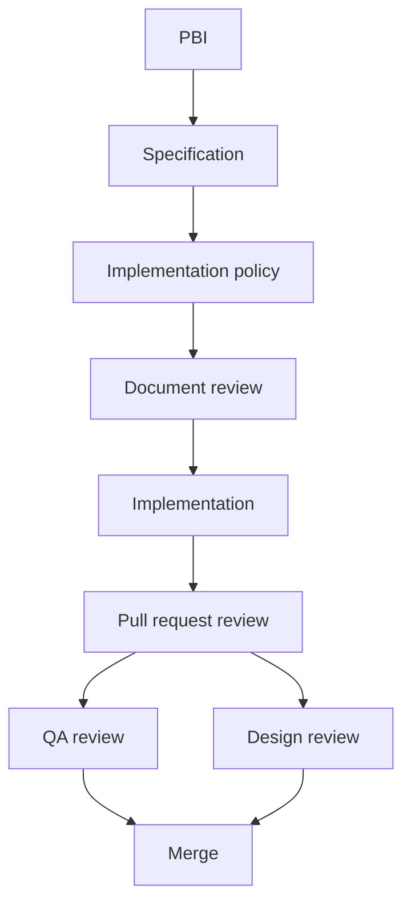
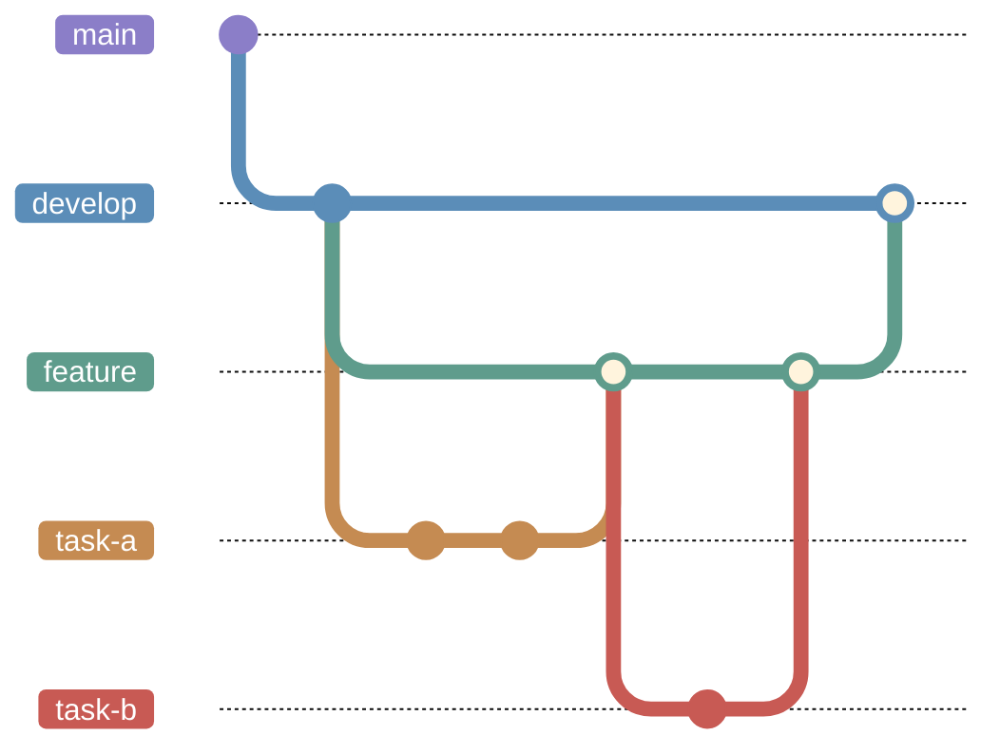
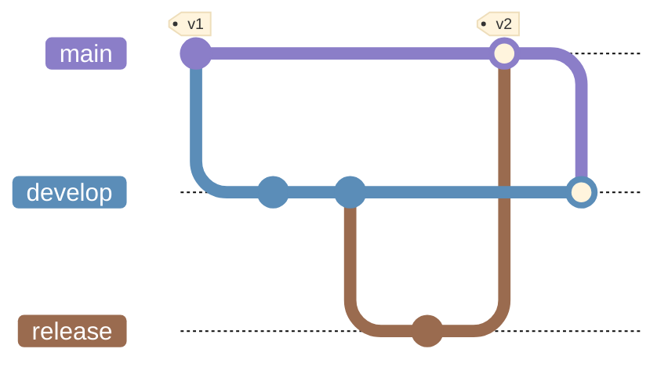
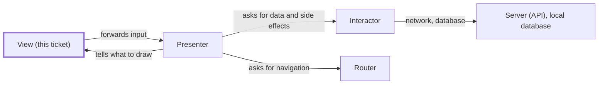
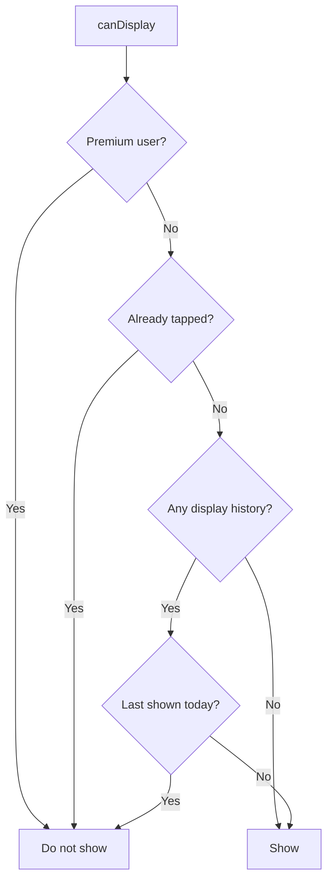
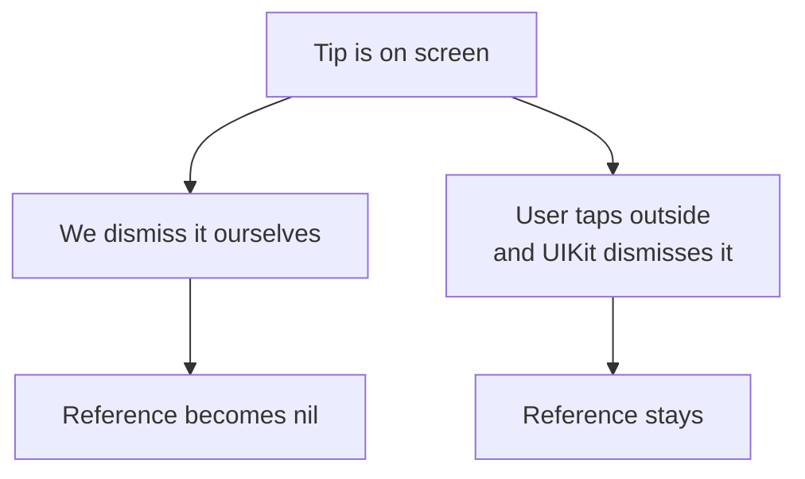
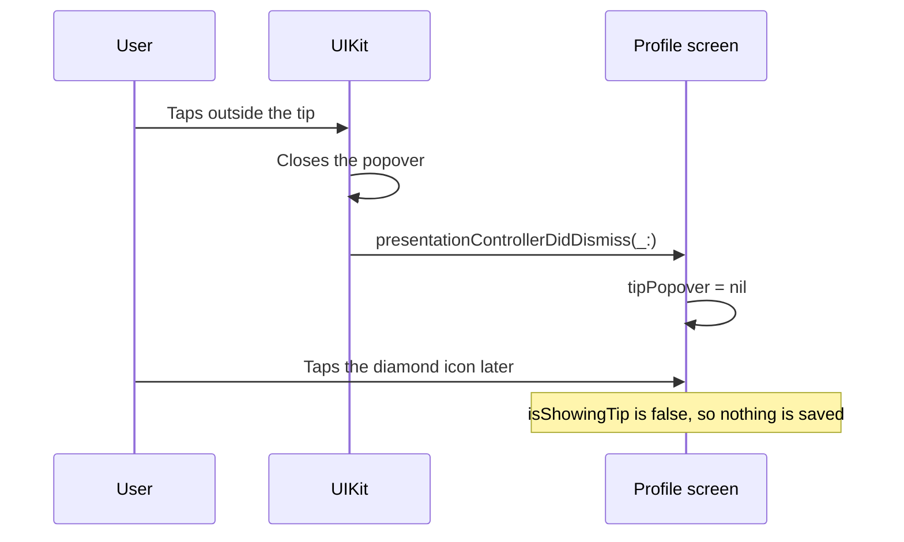
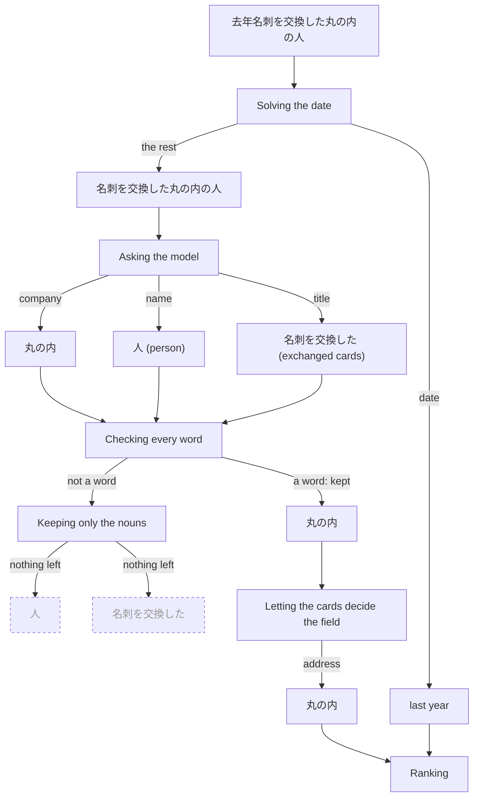
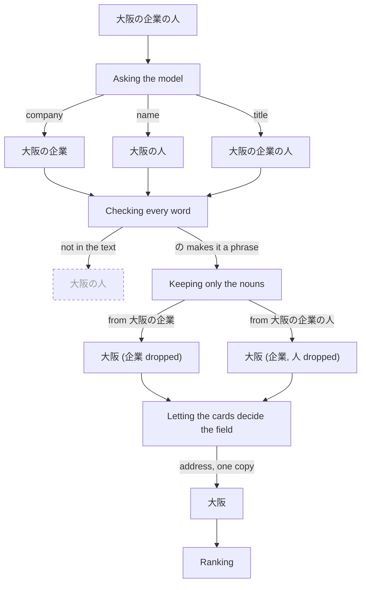
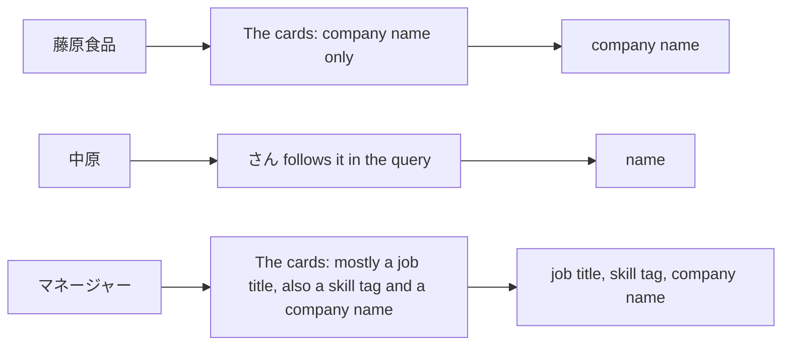

# What I built at Sansan

In August and September of 2026, I worked at [Sansan](https://jp.corp-sansan.com/) on the iOS team for [**Eight**](https://8card.net/), a business card app. Eight scans a paper business card (`名刺`) and keeps it as contact data, so the people you have met become a list you can search.

I was there two days a week. As an international student I am allowed to work 28 hours a week in total, and I was splitting those hours with a second internship at LINE, which I wrote about in [[LINE Internship|Six Weeks Building at LINE]].

**The thread through my tasks is that the work was decided before the code: in two documents for the tickets, and in a list of things to stop asking the model to do for the proof of concept.** My first two tasks were tickets in the premium registration flow, the screens through which a user signs up for Eight Premium, the paid plan, and that is where I learned how the team builds things. My last task was a **proof of concept (PoC)** evaluating Apple's on-device [Foundation Models](https://developer.apple.com/documentation/foundationmodels) framework, with Japanese search as the test case. For the two tickets, no code was written until two documents had been drafted and reviewed in Japanese, and that is where this story starts.

## What I Worked On

| Task                               | Area                      | Kind of work              | Status              |
| ---------------------------------- | ------------------------- | ------------------------- | ------------------- |
| Expanding the premium landing page | Premium registration flow | UI change                 | Shipped             |
| Showing the premium tip once a day | Premium registration flow | Behavior change and tests | Shipped             |
| Trying Foundation Models           | Technology evaluation     | Proof of concept          | Not part of the app |

> [!note]
> Every code sample below is a simplified stand-in written for this article rather than the code as it was committed. The example queries, people and companies in the search section are invented.

## How Work Moves Through the Team

**Every ticket takes the same path: two documents, a review of each, the code, and three separate reviews of the code.**

### From PBI to Merge

**Before any code, a ticket becomes two documents, and both are reviewed.**

A ticket arrives as a **PBI** (Product Backlog Item) written by the product manager. Before any code exists, I write two documents.

The first is the **specification**, which says what has to be true for the ticket to be finished, in statements that two people can read and reach the same conclusion about. The second is the **implementation policy**, which says how the change will be built, which layers of the architecture it will touch, and what it will not touch.

Both get reviewed, and then I begin the implementation. When the code is ready I open a **pull request**, a request to merge my branch, which other engineers review line by line. Once they approve, I request two more reviews separately: **QA**, the quality assurance team, who test the build by hand on a device, and design, where the designer checks the result against the design.



### Feature Branches

**Features merge into an integration branch, not straight into `main`.**

I had used Git before, but not **git-flow**, a branching convention that gives a few long-lived branches fixed roles. A **branch** is a line of work that can later be merged into another. Features merge into an integration branch, not into `main`. For a feature the team cuts a branch off that integration line, then a smaller branch off that one for each piece of work. Each small branch gets its own pull request into the feature branch. The feature branch has a pull request of its own into the integration branch, opened as a draft when the feature starts and marked ready for review when it is finished. QA checks that build on a device, and once the pull request is approved it is merged.

The diagrams use ordinary git-flow names for those roles: `develop` for the integration branch, `feature` for one feature, `task-a` for one piece of it.



### Releases

**A merge into `main` is a release, which is why features never go there directly.**

`main` does not hold the latest code. When the team is ready to ship, a release branch is cut from the integration branch and the version number is bumped on it. A pull request from that branch into `main` is opened. Merging it tags the version and creates the release, and after that `main` is merged back so the integration branch picks up the version bump too.



The integration branch is therefore ahead of `main` nearly all of the time. If a feature merged into `main` directly, `main` would hold unreleased code, and it would stop matching the version on the App Store.

### The Daily Report

**The reply to my first daily report reframed the two documents as engineering work, not paperwork.**

Every day I wrote a **daily report** with what I did, what I learned, what I got stuck on, and what I wanted to ask my mentor. My mentor read it and wrote back.

The reply to my first report was the longest one I received. I had written that the specification and the implementation policy were the first documents of that kind I had produced. The answer was that writing them is not a formality before the real work. It is the work of putting two things in a form another person will read the same way I do: what has to be true for the task to be done, and in what order it should be built.

## Expanding the Premium Landing Page

**The first ticket removed a toolbar from one screen. The code is a handful of lines; the work was two documents showing that a handful of lines was all it would take.**

### The Problem

**The premium landing page carried a toolbar whose three buttons did nothing useful there, and the ticket asked for that strip to become content.**

Eight's premium landing page is the page in the premium registration flow that presents Eight Premium. It is a web page shown inside the app in a **web view**, a browser window embedded in an app screen. It had a **toolbar**, a bar of buttons along the bottom edge, with back, forward and reload buttons. On a landing page none of those three buttons is necessary, and the space could go to more of the web view's content, the part that explains the premium benefits.

<figure style="margin: 1.5rem 0;">
  
  <figcaption style="margin-top: 0.6rem; color: var(--gray); font-size: 0.82rem; line-height: 1.5; text-align: center;">Before-and-after comparison of the Premium landing page, showing the additional content space gained by removing the unnecessary WebView toolbar.</figcaption>
</figure>

### The Specification

**The specification turned the PBI's acceptance criteria into four statements a person can go and check.**

A PBI states what it asks for as numbered **acceptance criteria**, the conditions that have to hold for the ticket to count as done, written as AC1, AC2 and so on, and my specification has to turn each of them into something a person can go and check. For this ticket that came down to four statements:

- The toolbar area is not displayed on the premium landing page
- The space it freed becomes content, not blank padding
- The result matches the design
- The way to close the screen is still there

The last one is the Close button in the **navigation bar**, the bar along the top of the screen that holds the title and a few buttons, which the Before screenshot shows.

In the implementation policy I wrote where the change lived, which was the View layer of a VIPER module. That sentence only means something once VIPER is explained.

### The VIPER Architecture

**VIPER splits a screen into five parts, and only one of them, the View, draws. "The change lives in the View layer" is a promise that data and navigation stay untouched.**

[VIPER](https://www.objc.io/issues/13-architecture/viper/) is how the team splits one screen into parts. One screen is one **module**, and a module is five parts:

| Part | What it does |
| --- | --- |
| **V**iew | Draws the screen and receives taps. It holds no business logic, the rules about data such as what a purchase does, and forwards what the user did to the Presenter |
| **I**nteractor | Talks to the network and to the database, and runs the business logic. Everything with an outside effect lives here |
| **P**resenter | Decides what the screen should show. It sits between the View, the Interactor and the Router |
| **E**ntity | The plain data types the module works with |
| **R**outer | Moves to another screen, and builds the module in the first place |



Entity is the data the arrows carry, so it has no box of its own. The View talks only to the Presenter. It never reaches the Interactor or the Router, so a change inside it cannot reach data or navigation. That is why the policy has to name the layer: it is a promise about what will not move.

### The Implementation Policy

**The policy said where the change lived, the View, and spent most of its length on what it would not touch.**

The screen is built with [UIKit](https://developer.apple.com/documentation/uikit), Apple's framework for writing iOS screens in code, and laid out with [SnapKit](https://github.com/SnapKit/SnapKit), a small library that shortens UIKit's layout rules. After saying where the change lived, I spent most of the document on what it did not touch:

- No change to the local database's **schema**, the shape of the data the app stores on the phone, and so no **migration**, the step that converts already-stored data into a new shape
- No change to the **API**, the calls the app makes to Eight's servers
- No change to the toolbar used on other screens
- No new or changed analytics
- No effect on restoring the phone from a backup

### Making the Change

**Two edits: delete the code that showed the toolbar, and let the web view's bottom edge reach the edge of the screen.**

The first edit is a deletion. Every screen inherits a `viewWillAppear` method that runs just before it comes on screen. This screen **overrode** it, that is, supplied its own version, and the one extra step in that version was showing the toolbar. Here `showWebViewToolbar()` stands in for the call that showed the toolbar:

```swift
// Removed
override public func viewWillAppear(_ animated: Bool) {
    super.viewWillAppear(animated)
    showWebViewToolbar()
}
```

Deleting the toolbar satisfies the first statement of the specification, not the second. The **safe area** is the part of the screen not covered by the hardware, by the system, or by bars the app itself shows: at the top, the camera cutout (the notch, or the Dynamic Island on newer iPhones) and the status bar with the clock and battery; at the bottom, the **home indicator**, the thin bar you swipe up on; and any bars the app shows, here the navigation bar at the top and the toolbar at the bottom. Pinning a view to the safe area keeps its content clear of all of those. The web view was pinned to it at the top and at the bottom. With the toolbar gone, the safe area's bottom edge moves down, but only as far as the home indicator, so a web view still pinned to it stops short of the bottom and leaves a blank strip there:

| | Before | Toolbar deleted only | After |
| --- | --- | --- | --- |
| Top | Navigation bar with the Close button | Navigation bar | Navigation bar |
| Middle | Web view, pinned to the safe area | Web view, still pinned to the safe area | Web view, to the edge of the screen |
| Bottom | Toolbar: back, forward, reload | Blank strip above the home indicator | Home indicator over the page |

For the second statement, no blank padding, the web view's bottom edge has to be released from the safe area to the edge of the screen. That is the second edit:

```swift
// Before
make.verticalEdges.equalTo(view.safeAreaLayoutGuide.snp.verticalEdges)

// After
make.top.equalTo(view.safeAreaLayoutGuide.snp.top)
make.bottom.equalToSuperview()
```

SnapKit reads left to right: `make` *this edge of my view* `.equalTo` *that edge of something else*. `verticalEdges` is the top and the bottom together, so the first line pinned both to the safe area. The two lines replacing it say the top still follows the safe area, and the bottom follows the `superview`, the view that contains it, which runs to the physical bottom of the screen.

Those two edits, one line replaced by two and a four-line method deleted, are the whole change. The Close button in the navigation bar is untouched, which is the fourth statement of the specification. The change shipped.

### What the First Task Taught Me

**Most of what the implementation policy says is "no", and each "no" was a check I ran, not a guess.**

I did not know that any of it was "no" until I went and checked. What the document holds is the outcome of those checks, which is how I found out the change was as small as it looked.

## Showing the Premium Tip Once a Day

**The second ticket changed one display rule. The work was in two places: making a date rule something a test can run, and telling a tap on the tip apart from an ordinary tap on the button.**

### The Problem

**The ticket asked for two changes to one hint: show it once a day instead of once a month, and never again once the user has acted on it.**

Eight's profile screen has a diamond icon in the navigation bar. The icon leads to the premium screen, and a **popover**, a small box that floats over the screen and points at a control, points at it with the text *"Eight Premium: 7-day free trial"* (in Japanese in the app). The popover is a **tip** built with Apple's [TipKit](https://developer.apple.com/documentation/tipkit) framework, and "the tip" is what this article calls it from here. The tip appeared at most once every 30 days. The ticket asked for it to be shown once per **calendar day** instead, that is, at most once between one midnight and the next, and to stop showing it at all to anyone who had already tapped the icon while the tip was pointing at it.

| Rule                                        | Before                               | After                                                      |
| ------------------------------------------- | ------------------------------------ | ---------------------------------------------------------- |
| Interval                                    | ≥ 30 days since last shown           | Once per calendar day                                      |
| After a tap on the icon while the tip shows | Not recorded; shown again in 30 days | Never shown again                                          |
| For premium users                           | Not shown                            | Unchanged                                                  |
| Saved on the device                         | Last displayed date                  | Last displayed date **and** a flag that the tip was tapped |
|                                             |                                      |                                                            |

That table is my own summary of the first of the PBI's two acceptance criteria, AC1. AC2 was a single sentence asking that the new rule still work as-is once the app adopts [Liquid Glass](https://developer.apple.com/documentation/technologyoverviews/liquid-glass), the design material Apple introduced in iOS 26. Nobody can verify a sentence like that, because "works as-is" names nothing to check, so the specification restated it as two lines that somebody can check:

- The display rule produces the same result under the existing design and under Liquid Glass
- The display rule does not consider which design is active

The function in Making the Rule Testable is the check for both.

### Where the Display Rule Lives

**TipKit draws the tip. The app decides when to show it and keeps the two values the decision needs, because TipKit's own record can be neither read nor edited while the app runs.**

TipKit is Apple's framework for hints like this one. A tip is a type that describes its own content, and the framework presents it as a popover pointing at a view. The tip itself is small:

```swift
struct PremiumTip: Tip {
    var title: Text {
        Text("Eight Premium: 7-day free trial")
    }
}
```

TipKit can also decide *when* a tip shows, with rules of its own and one display frequency for the whole app. This tip does not use that. The app decides for itself when to show it.

The reason is that TipKit keeps its own record of what it has shown, and the app cannot read or change that record while it runs. TipKit answers "should this tip display now?" but not "when did it last display?", and its one reset takes effect only at the next launch. A test for "shown yesterday, so show today" has nowhere to put yesterday's date. So the app keeps the last displayed date and the tap flag itself, where a test can set them.

In VIPER terms, the rule became a function in the Entity layer with no dependencies. The Interactor reads the two saved values and calls it, and the View shows the popover and works out whether a tap on the icon was a tap on the tip.

### Making the Rule Testable

**I moved the rule into a function whose every input is an argument, so a test can choose the saved values, the date and the time zone.**

A `Date` in Swift is an instant, a point in time with no time zone attached. Which day that instant falls on depends on where you ask. Here is the rule that decided whether to show the tip before my change:

```swift
func canDisplayTip(isSubscriber: Bool) -> Bool {
    guard isSubscriber == false else { return false }
    guard let lastShown = storedLastShownAt,
          let daysSince = Calendar.current.dateComponents(
              [.day], from: lastShown, to: .now
          ).day else {
        return true
    }
    return daysSince >= 30
}
```

Nothing is wrong with it, but it does two things at once. It reads a saved date, and it asks the system what today is. A test can set that saved date, but it cannot choose what time it is now or which time zone the device is in, so the only way to test the day boundary is to launch the app and move the device clock forward.

My specification had said the new day comparison would use `Calendar.current.isDateInToday(_:)`, which has the same problem. It asks whether a date falls on the day on which the code happens to run, and a test cannot choose what that day is.

Writing the implementation policy is where I caught that. The comparison became [`isDate(_:inSameDayAs:)`](https://developer.apple.com/documentation/foundation/calendar/isdate%28_:insamedayas:%29), which asks whether two given dates fall on the same day in a given calendar, and every value the rule needs became an **argument**, a value handed in by whoever calls the function. The rule moved into a new type, `TipDisplayRule`, with a single static method:

```swift
static func canDisplay(
    isSubscriber: Bool,
    wasTipTapped: Bool,
    lastShownAt: Date?,
    calendar: Calendar,
    now: Date
) -> Bool {
    guard isSubscriber == false else { return false }
    guard wasTipTapped == false else { return false }
    guard let lastShownAt else { return true }
    return calendar.isDate(lastShownAt, inSameDayAs: now) == false
}
```

Given the same five values it always gives the same answer, on any device, in any time zone. That is what makes it testable. It is also how AC2 is met: none of the five arguments is the design, so the answer cannot depend on which design is active.

The order of the checks is the whole rule. A premium user with no history at all is still told no, because the premium check comes first:



The method that used to hold the rule now only reads the saved values and passes them in. It lives in the Interactor:

```swift
func canDisplayTip(isSubscriber: Bool) -> Bool {
    TipDisplayRule.canDisplay(
        isSubscriber: isSubscriber,
        wasTipTapped: storedTipWasTapped,
        lastShownAt: storedLastShownAt,
        calendar: .current,
        now: .now
    )
}
```

### Writing the Tests

**Two tests carry the rule: one runs it over four display histories with the tap flag set, and one gives the same two instants to two calendars and expects two different answers.**

The project uses [Swift Testing](https://developer.apple.com/documentation/testing). `@Test` marks a function as a test and gives it a name, `#expect` states what must be true, and a test function can take `arguments`, in which case the framework runs it once per argument and reports each run as its own case. `gmtCalendar` and `reference` are two fixed values shared by every test in the file, a calendar pinned to GMT and one instant in it, and `shifted(by:times:)`, `gmtDate` and `zonedCalendar(offsetHours:)` are small helpers that build dates and calendars from them. **GMT** is the zero-offset time zone that every other zone is measured from.

```swift
@Test(
    "Does not show again once the tip has been tapped",
    arguments: [nil, 0, 1, 30] as [Int?]
)
func staysHiddenAfterTap(shownDaysAgo: Int?) {
    let result = TipDisplayRule.canDisplay(
        isSubscriber: false,
        wasTipTapped: true,
        // nil stays nil; a number n becomes the date n days before the reference instant
        lastShownAt: shownDaysAgo.map { shifted(by: .day, times: -$0) },
        calendar: gmtCalendar,
        now: reference
    )

    #expect(result == false)
}
```

That is four cases: never displayed, displayed today, yesterday, and thirty days ago, the old rule's interval. Pinning the calendar to GMT means the cases name the same instants on a machine in Tokyo and on a machine anywhere else.

One more test shows why the rule takes a `Calendar` at all:

```swift
@Test("The day changes at midnight in the calendar's own time zone")
func dayBoundaryFollowsTheCalendarsZone() {
    // Both instants are built with the GMT calendar
    // The same day in GMT, two different days in JST
    let lastShownAt = gmtDate(year: 2026, month: 3, day: 5, hour: 10)
    let now = gmtDate(year: 2026, month: 3, day: 5, hour: 18)

    let resultInGMT = TipDisplayRule.canDisplay(
        isSubscriber: false,
        wasTipTapped: false,
        lastShownAt: lastShownAt,
        calendar: gmtCalendar,
        now: now
    )
    let resultInJST = TipDisplayRule.canDisplay(
        isSubscriber: false,
        wasTipTapped: false,
        lastShownAt: lastShownAt,
        calendar: zonedCalendar(offsetHours: 9),
        now: now
    )

    #expect(resultInGMT == false)
    #expect(resultInJST)
}
```

The two instants are eight hours apart. Read in GMT they fall on the same day. Read in Tokyo, nine hours ahead (JST), midnight falls between them:

|                      | GMT calendar | Tokyo calendar (JST, GMT+9) |
| -------------------- | ------------ | --------------------------- |
| Last shown           | Mar 5, 10:00 | Mar 5, 19:00                |
| Now                  | Mar 5, 18:00 | Mar 6, 03:00                |
| Same calendar day?   | Yes          | No                          |
| `canDisplay` answers | `false`      | `true`                      |

The rule answers `false` for one calendar and `true` for the other, which is only possible if it reads the day from the calendar it was given. That is the evidence that the day now comes from the argument and not from the device.

### Counting a Tap on the Tip

So far, the ticket's first half, the daily rule. The second half, never showing the tip again after a tap, is not about dates. It is about touches.

**Recording a tap on the tip means knowing whether the tip was on screen at the moment the icon was tapped, and it took three versions of one property to know that reliably.**

The tip is a popover, and a popover is not only the box on screen. UIKit also lays an invisible view over the rest of the screen, underneath the box, and that view exists to catch the next touch outside the popover and close it. That is why a popover normally spends the first tap on closing itself. The touch stops at the invisible view and never reaches what is underneath.

Here that would mean two taps to reach premium: one to close the tip and one on the diamond icon, which is a button. That button is therefore handed to the popover as a **passthrough view**, one of the views the invisible view ignores, so that touches on it go through to the button:

```swift
// popover is the TipKit popover
popover.popoverPresentationController?.passthroughViews = [premiumButton]
```

With that line in place, there are three things the user can tap while the tip is on screen:

| The user taps | What happens |
| --- | --- |
| Anywhere else on the screen | The invisible view catches the touch. UIKit closes the tip, and nothing underneath is pressed |
| The tip itself | Nothing. The tip has no button in it, and a touch on the tip is not a touch outside it |
| The premium button | The touch passes through to the button, and the button's **handler**, the code that runs when it is tapped, runs. UIKit does not close the tip, so the handler has to |

The last row is where the problem is. The handler is told the same thing whether the tip was on screen or not, because a tap on the button is a tap on the button. Nothing in it mentions the tip.

"The user tapped through the tip" is therefore something the app has to work out itself, by asking whether the tip was on screen at the moment the button was tapped:

```swift
private func premiumButtonTapped() {
    recordTipTapIfNeeded() // must run before closeTip(), which clears the reference
    closeTip()
    openPremiumRegistration()
}

private func recordTipTapIfNeeded() {
    guard isShowingTip else { return }
    // save the tap flag
}
```

Everything depends on how `isShowingTip` answers.

**First version.** It checked whether the app was still holding the popover object:

```swift
// First version, and it is wrong
private var isShowingTip: Bool {
    tipPopover != nil
}
```

The app set that reference when it presented the tip, and cleared it when it dismissed the tip itself. The problem was that the app is not the only thing that can dismiss it. If the user taps anywhere else, UIKit closes the tip, and UIKit knows nothing about our property. The tip leaves the screen and the reference stays behind.



The consequence takes three steps. The tip shows, the user taps the background, UIKit closes it, and the reference stays. Later that day the user taps the diamond to look at premium; `isShowingTip` says `true`, and the tap is saved. The tip never shows again for that user, because the flag never goes back to `false`.

**Second version.** It stopped asking about our own property and asked the view instead:

```swift
// Second version. Correct, and replaced in review
private var isShowingTip: Bool {
    tipPopover?.viewIfLoaded?.window != nil
}
```

A view that is on screen belongs to a window, the root view that holds everything on screen, and a view that has been removed does not, no matter who removed it. (`viewIfLoaded` is `view` without the side effect of loading it.) This version is correct, and it was replaced in review by one that does not need to look into the view hierarchy at all.

**Third version.** The one I kept goes back to the first version's check and fixes the reference instead. The TipKit popover has a `presentationDelegate`, a **delegate** being an object it tells about presentation events. It is set to the profile screen's view controller, and when UIKit closes the popover it calls the delegate's `presentationControllerDidDismiss(_:)`. That is where the reference is cleared. UIKit does not make that call when the app closes the popover itself, so `closeTip()` still clears the reference on that path.

```swift
// Third version, the one I kept
private var isShowingTip: Bool {
    tipPopover != nil
}

// Set when the tip is presented
tipPopover?.presentationDelegate = self

// UIKit calls this when it closed the popover, for example after a tap outside it
func presentationControllerDidDismiss(_ presentationController: UIPresentationController) {
    tipPopover = nil
}
```



Now the reference tells the truth no matter who closed the tip, and `isShowingTip` is a one-line comparison again.

| Version | `isShowingTip` asks | Wrong when | Outcome |
| --- | --- | --- | --- |
| 1 | Is our reference to the popover set? | UIKit closed the tip and the reference stayed | Wrong |
| 2 | Is the popover's view in a window? | Never, but it has to look into the view hierarchy | Replaced in review |
| 3 | Is our reference set? UIKit clears it through the delegate when it closes the tip | — | Kept |

### What the Second Task Taught Me

**A `Date` is an instant, and it only becomes a day once you say whose time zone you are asking about. I did not see that until I had to name every test case.**

The rule looked obviously correct to me until I had to commit to an answer for each case: no history at all, today, yesterday, thirty days ago, and the same two instants read in GMT and in Tokyo. The catch happened while writing the implementation policy, before any code. The tap half taught the same thing from the other side. A flag that says what is on screen is only true if every party that can change the screen also updates the flag, and UIKit was one of those parties.

## Trying Foundation Models on Japanese Search

To find out which kinds of processing Foundation Models handles well and which are hard to hand off to it, I used business card search as a test case. The **on-device model** is a language model that runs on the phone itself, so the query never leaves it, and [Foundation Models](https://developer.apple.com/documentation/foundationmodels) is the Swift framework that gives an app access to it.

What I built takes a Japanese query, pulls the searchable words out of it, decides which field of a card each word belongs in, and runs a search that matches field by field and ranks the results. The model does one step inside that, and Swift does everything around it. A search is fast enough to feel like a search. It worked well enough to show what the model handles well and where it struggles, and it still has two clear limits: the model puts words in the wrong field, and place names the dictionary does not know are split in two. Both come up below.

### Learning Foundation Models

**Foundation Models can hand back a typed Swift value instead of free text, and that is the one feature the search is built on.**

I had never used the framework, so I started outside the codebase with a sample app and changed one small thing at a time. The smallest thing that works fits in a [playground](https://developer.apple.com/documentation/xcode/running-code-snippets-using-the-playground-macro), a scratch file in which Xcode runs a snippet and shows its output:

```swift
import FoundationModels
import Playgrounds

#Playground {
    let session = LanguageModelSession()
    let response = try await session.respond(to: "List all states in Brazil.")
    print(response.content)
}
```

[`LanguageModelSession`](https://developer.apple.com/documentation/foundationmodels/languagemodelsession) is the conversation, and `respond(to:)` asks it something and waits for the whole answer. There is also `streamResponse(to:)`, which hands back the answer piece by piece as it is written. That suits a chat window, not a search box, which cannot act on half an answer, so I did not use it.

The part that matters for search is [**guided generation**](https://developer.apple.com/documentation/foundationmodels/generating-swift-data-structures-with-guided-generation). The app does not read text out of a reply and parse it. It declares a **struct**, a Swift type that groups named values, marks it with two attributes, and the framework makes the model produce a value of that type:

```swift
@Generable(description: "Search conditions taken from a sentence about a person")
struct QueryFields {
    @Guide(description: "Any company the sentence mentions")
    var organizations: [String]

    @Guide(description: "Any person's name the sentence mentions")
    var people: [String]

    @Guide(description: "Any job title or department the sentence mentions")
    var roles: [String]
}
```

[`@Generable`](https://developer.apple.com/documentation/foundationmodels/generable%28description:%29) turns the struct into a **schema**, a description of the shape the answer must take, which properties and what type each one holds, and [`@Guide`](https://developer.apple.com/documentation/foundationmodels/guide%28description:%29) is the description the model reads for each property. The answer arrives already typed: a `QueryFields` holding three lists of strings, not a block of text to pick apart.

> [!note]
> The struct above is simplified. The one I used describes each property in Japanese with examples, and the session also gets a list of rules to follow. The property names below are the ones in this sample.

### The Pipeline

**Everything Swift can solve on its own is solved before the model is called, and everything the model returns is checked afterwards.**

Take one query and follow it through the pipeline. I chose a harder one than a plain name-and-company query on purpose: `去年名刺を交換した丸の内の人`, "someone in Marunouchi I exchanged business cards with last year". It has a date, a verb phrase, and a place name with a `の` inside it (`丸の内` is a business district in Tokyo), so every step has something to do.



Each step is a section below, with the same name. Dashed boxes are values that did not survive.

### Solving the Date

**Dates are resolved in Swift before the model sees the query, because the model gets them wrong.**

I do this in Swift because the model is bad at dates. In some cases, it misreads `昨日` ("yesterday") as a day in the previous year, and `2024年` ("the year 2024") as a single day. So Swift matches the query against a list of date patterns, `去年` ("last year"), `昨日`, `3日前` ("three days ago") and so on, tried longest first, turns the match into a range of dates, and cuts it out of the sentence before the model sees it:

| Stage                   | Value                                                                    |
| ----------------------- | ------------------------------------------------------------------------ |
| What the user typed     | `去年名刺を交換した丸の内の人`                                                         |
| Resolved in Swift       | From 2025-01-01 00:00 up to, not including, 2026-01-01 00:00, Japan time |
| What the model is given | `名刺を交換した丸の内の人`                                                           |

Cutting the date out has a side effect I like. If nothing searchable is left, the model is not called at all: `去年` on its own becomes a date range and nothing else.

### Asking the Model

**The model is called once, here, and what it returns is a set of candidates, not an answer: for this query, one of its three values is worth searching for.**

The app hands `名刺を交換した丸の内の人` to the model and gets this back:

| Label          | Value         |
| -------------- | ------------- |
| `organizations` | `["丸の内"]`     |
| `people`        | `["人"]`       |
| `roles`         | `["名刺を交換した"]` |

The model sorts words into three **labels**: company, name and title. A card has more **fields** than that: company name, name, job title, department, address and tags. In this article, a label is what the model said, and a field is where the app actually searches.

`丸の内` is a place, and the model put it under company names. It also returned `人`, which only means "person", as a name, and `名刺を交換した` ("exchanged business cards"), a piece of the sentence, as a title.

### Checking Every Word

**Each value the model returns is checked twice: is it really in the sentence, and is it a word rather than a piece of a sentence?**

First, the app checks whether the value appears in the text the model was given. This catches words the model made up. For `大阪の企業の人` ("someone at a company in Osaka") the model once returned `大阪の人` ("someone from Osaka") as a name. That string is not in the sentence, so it is thrown away without a second look. Here all three values pass, since they are all in `名刺を交換した丸の内の人`.

Then, the app checks whether the value is a word that could be printed on a card, or a piece of a sentence. Japanese is written without spaces, so there is no gap to look for; the app has to know what each part of the text is. A short list runs first. A value that *is* a word that never picks a person out, such as `人` ("person"), or that *contains* a word never printed on a card, such as `名刺` ("business card"), fails this check right away. Everything else goes to MeCab, the tool in the next section, which answers one question: does the value contain a **particle**, a verb, or an auxiliary verb? A particle is one of the short grammatical words, such as `を` (the object marker) or `の` ("of"), that glue a Japanese sentence together, and a value with one inside is a piece of a sentence.

Failing the second check does not mean being thrown away. A piece of a sentence can have a useful word inside it, so the app cuts it into its nouns and looks at each one. That is the subject of Keeping Only the Nouns.

|           | The check                                | Fails when                                                                               | Then               |
| --------- | ---------------------------------------- | ---------------------------------------------------------------------------------------- | ------------------ |
| Check 1   | Is it in the text the model was given?   | `大阪の人` is not                                                                            | Thrown away        |
| Check 2   | Is it a word, not a piece of a sentence? | `人` is on the list. `名刺を交換した` contains `名刺`, and MeCab finds a particle and a verb in it | Cut into its nouns |
| Both pass |                                          | `丸の内`                                                                                    | Searched as it is  |

For our query, `丸の内` passes both checks. `人` and `名刺を交換した` fail the second one. The next section is about how MeCab tells a word from a piece of a sentence, because that is the part I could not get right without it.

### Telling a Word from a Phrase

**To tell a word from a piece of a sentence I needed the part of speech of every piece, and for Japanese only MeCab gave me that.**

A **part of speech** is the grammatical class of a piece of text: noun, verb, particle and so on. I got to MeCab by way of three attempts that did not work:

| What I tried                                                                                                                                                                        | How                                                                                                  | What happened                                                                                                                                                                         | What I concluded                                                               |
| ----------------------------------------------------------------------------------------------------------------------------------------------------------------------------------- | ---------------------------------------------------------------------------------------------------- | ------------------------------------------------------------------------------------------------------------------------------------------------------------------------------------- | ------------------------------------------------------------------------------ |
| A list of phrases to delete                                                                                                                                                         | A list of over a hundred phrases, deleted wherever they appeared in a value, longest first           | Almost every phrasing that was not on the list came out wrong                                                                                                                         | A list cannot keep up with how people phrase things                            |
| A character rule for particles                                                                                                                                                      | Treat `の`, `が` and the like between kanji, katakana or Latin characters as a particle, and cut there | It cut the place names `丸の内`, `霞が関`, `井の頭` and `自由が丘` in two, so the app searched for `丸` ("circle") and `内` ("inside") instead, and it let the verb phrase `受け取ったネビュラ` through whole | A character is not a particle. I needed to know what each piece of the text is |
| Apple's [`NLTokenizer`](https://developer.apple.com/documentation/naturallanguage/nltokenizer) and [`NLTagger`](https://developer.apple.com/documentation/naturallanguage/nltagger) | Cut the value into tokens and ask for the part of speech of each                                     | `NLTokenizer` only cuts. `NLTagger` has no part-of-speech scheme for Japanese, and every token comes back `OtherWord`                                                                 | Not usable for Japanese, and even noun and verb would have been too coarse     |
| [MeCab](https://taku910.github.io/mecab/) with IPADic                                                                                                                               | Analyze each value on its own; a particle, verb or auxiliary verb inside makes it a phrase           | All four place names stay whole. `受け取ったネビュラ` splits into a verb, an auxiliary verb and `ネビュラ`                                                                                         | This is what the PoC uses, with two gaps described below                       |

MeCab is a **morphological analyzer** for Japanese: it splits text into its smallest meaningful units and labels each one with its part of speech (`品詞`) and a finer sub-category. Both the split and the labels come from the dictionary it runs with, here **IPADic**, the standard word list that tells MeCab which strings are words and what each one is. MeCab can only keep whole a word its dictionary lists, which is why `丸の内` stays one word and `桜が丘` does not.

Each value the model returned is analyzed on its own, not as part of the query it came from, because the split changes with the surroundings. Inside `丸の内の人`, IPADic reads `内の人` as a word and the split becomes `丸` / `の` / `内の人`; on its own, `丸の内` stays whole. This is what MeCab prints for `丸の内` and `名刺を交換した` (`EOS` marks the end of the input):

```sh
$ echo "丸の内" | mecab
丸の内	名詞,固有名詞,地域,一般,*,*,丸の内,マルノウチ,マルノウチ
EOS
$ echo "名刺を交換した" | mecab
名刺	名詞,一般,*,*,*,*,名刺,メイシ,メイシ
を	助詞,格助詞,一般,*,*,*,を,ヲ,ヲ
交換	名詞,サ変接続,*,*,*,*,交換,コウカン,コーカン
し	動詞,自立,*,*,サ変・スル,連用形,する,シ,シ
た	助動詞,*,*,*,特殊・タ,基本形,た,タ,タ
EOS
```

The first label on each line is the part of speech, and the labels after it refine it:

| Value | Piece | Part of speech |
| --- | --- | --- |
| `丸の内` | `丸の内` | proper noun, a place (`名詞,固有名詞,地域`) |
| `名刺を交換した` | `名刺` | noun (`名詞`) |
| | `を` | particle (`助詞`) |
| | `交換` | noun that pairs with `する`, "to do" (`名詞,サ変接続`) |
| | `し` | verb (`動詞`), a form of `する` |
| | `た` | auxiliary verb (`助動詞`), the ending that marks past tense |

So `丸の内` is one word, because IPADic lists it as a single place name, and `名刺を交換した` is a phrase, because it has a particle, a verb and an auxiliary verb in it, and any one of the three would be enough.

Two gaps remain. Place names the dictionary does not list are still split: `桜が丘` (Sakuragaoka, a common neighborhood name) comes out as `桜` / `が` / `丘`, and that is a known gap. And IPADic has few given names written in **hiragana**, the phonetic script used for grammatical endings and for some names, where most names are written in **kanji**, the Chinese-derived characters. Parsed on their own, hiragana names come back as verbs or adjectives: `はやし` (the surname Hayashi) is read as a form of the adjective `はやい` ("fast"), and `みのる` (the given name Minoru) as the verb "to bear fruit".

```sh
$ echo "はやし" | mecab
はやし	形容詞,自立,*,*,形容詞・アウオ段,文語基本形,はやい,ハヤシ,ハヤシ
EOS
$ echo "みのる" | mecab
みのる	動詞,自立,*,*,五段・ラ行,基本形,みのる,ミノル,ミノル
EOS
```

So a value written entirely in hiragana counts as a phrase only if it is nothing but particles.

### Keeping Only the Nouns

**A value that fails the second check is not thrown away, because a useful word may be inside it. It is cut into its nouns, and each noun is kept or dropped on its own.**

`名刺を交換した` has two nouns, `名刺` and `交換`, and the app drops both, for different reasons.

**`名刺` only says what the user is looking for.** It is on a short list of words the app sets aside: words for a person or a company in general, legal forms printed on almost every card, names of fields on the card, and words about the search itself, such as `名刺`, rather than anything printed on a card.

None of these picks a person out. Most are never a value on a card at all, and the legal forms are the opposite, printed on almost every card. Either way, a match on them is noise. Search is a **substring match**: a card matches if the word appears anywhere inside a field's text. So `人` would find someone whose department is `人事部` ("personnel department"), where those characters are not the word `人` at all; there `人` is the first half of `人事` ("personnel"), read differently and inseparable from it. The name the model returned, `人`, is dropped for the same reason.

**`交換` is a noun that forms a verb with `する`.** Many Japanese nouns pair with `する` ("to do") to make a verb, here `交換する`, "to exchange", with `する` carrying the tense and the noun staying a noun. IPADic marks such nouns `サ変接続`, meaning they connect to `する`, and that is the sub-category the app reads. The app drops one of these nouns only when a form of `する` actually follows it. Here `し` comes right after `交換`, so `交換した` is something the user did, and that is not written on anyone's card. When nothing follows, the noun stays: `営業` ("sales") in `営業部` ("sales department") is a department name, and IPADic gives that same mark to `営業`, `開発` ("development"), `企画` ("planning") and much of the rest of the vocabulary of a business card, so the rule has to be this narrow. It still has a blind spot. Someone who types `営業している人` ("a person who does sales") loses `営業`, even though `営業部` is on the cards.

| Value | After the noun | What happens |
| --- | --- | --- |
| `交換した` | `し`, a form of `する` | `交換` dropped |
| `営業部` | `部`, a suffix | `営業` kept, joined to `部` |
| `営業している人` | `し`, a form of `する` | `営業` dropped: the blind spot |

Two smaller rules finish the job. Nouns that survive next to each other are joined back into one word, which is how `営業部` comes back together after MeCab cuts it into `営業` and `部`. And three more kinds of noun are dropped, none of which this query has: honorifics such as `さん`, suffixes left with nothing to attach to, and pieces of dates.

With both nouns gone, nothing is left of `名刺を交換した`, and the whole value is dropped.

Other values do leave something behind. For `大阪の企業の人` the model returns `大阪の企業` ("a company in Osaka") as a company, `大阪の人` ("someone from Osaka") as a name, and the whole sentence as a title:



`企業` and `人` are on that list and are dropped, which leaves `大阪` twice. The app keeps one copy and searches for `大阪` once, as an address, which is where the invented cards I used for the evaluation have it.

Back to `去年名刺を交換した丸の内の人`. After these checks only `丸の内` is left, still labeled a company by the model. From here on that label is only a starting point. Which fields the word is actually searched in is decided by the user's own cards.

### Letting the Cards Decide the Field

**Which fields a word is searched in is decided by where that word already appears on the user's own cards. The model's label is only a starting point.**

The model is good at splitting a sentence into words, but it often puts a word under the wrong label:

| Input                                                     | Where it ended up                        | Where it belongs |
| --------------------------------------------------------- | ---------------------------------------- | ---------------- |
| `ネビュラ株式会社の部長` ("the department head at Nebula Inc.")       | `部長` under names                         | job title        |
| `マーケと営業の人` ("someone in marketing and sales")             | `マーケ` and `営業` under company names       | department       |
| `山口さん` ("Yamaguchi-san")                                   | `山口` under company names                 | name             |

So instead of trying to make the model choose better, the app looks at the user's own cards. If `部長` appears in the job-title field of cards this user already has, it is very likely a job title. In `去年名刺を交換した丸の内の人`, `丸の内` appears only in addresses on the invented cards I used for the evaluation, so it is searched as an address alone, even though the model said company. If the cards have never seen a word, it is searched where the model's label points: the name field for a name, company names and addresses for a company, job titles and departments for a title.

> [!note]
> One rule of Japanese usage overrides the cards: a word followed by an **honorific** like `さん` (roughly "Mr." or "Ms."), as in `山口さん`, is a person, whatever the cards say. The app checks this against the text the user typed, with a short list of suffixes such as `さん`, `様` and `先生`, rather than with the dictionary. It cannot rely on the dictionary here, because after a hiragana surname like `はやし` IPADic misreads the whole thing and `さん` never comes out as a unit. IPADic does label `さん` as `名詞,接尾,人名`, a suffix that attaches to a person's name, and the app uses that label for something else: keeping `さん` out of the search word when a phrase is cut into nouns.

Here is a query where all three labels are right, `藤原食品でマネージャーをやっている中原さん` ("Nakahara-san, who works as a manager at Fujiwara Foods"). The model returns this:

| Label | Value |
| --- | --- |
| `organizations` | `["藤原食品"]` (Fujiwara Foods) |
| `people` | `["中原"]` (Nakahara) |
| `roles` | `["マネージャー"]` (manager) |

Three words, decided three ways:



`藤原食品` only ever appears as a company name on these cards, so the cards agree with the model and it is searched only there. `中原` is followed by `さん`, so it is searched as a name without asking the cards. `マネージャー` is less settled. It shows up mostly as a job title, and also as a **skill tag**, a skill a person lists on their own profile, and inside a company name, so the app searches those fields rather than trusting the label alone.

### Ranking

Finally, the app searches with what is left. Each word it searches for is one **condition**. Everyone who matches at least one condition is shown, and the date is the only hard rule: for our first query, `丸の内` is the one condition, and someone met outside last year is not shown at all. For the `藤原食品` query, a card with all three of `藤原食品`, `中原` and `マネージャー` is shown above a card that has only `中原`.

When two cards match the same number of conditions, the app orders them by how closely each word matches and by how sure it is that the word belongs in that field. Cards that are still tied are ordered by when they were exchanged, newest first.

### What Did Not Work

**The failure worth repeating is tool calling, the experiment I expected to keep and did not.**

I tried letting the model call [tools](https://developer.apple.com/documentation/foundationmodels/expanding-generation-with-tool-calling). A tool is a small Swift function the model can ask for while it answers, to look something up in the user's data. Every search got slower, including searches that had no use for a tool.

The time goes into the model, not into the tools. Each tool's name and description is part of the text the model reads before every answer, whether it calls the tool or not. Each call it does make is one more round of answering, over a longer conversation. And one of those lookups needed no model at all: the cards already decide which field a word belongs in. So I removed the tools.

### What the Third Task Taught Me

**Every version of this that worked better than the last was a version where the model did less.**

Dates go to Swift because the model gets them wrong. Invented words are caught by a check against the text the model was given, pieces of sentences are caught by MeCab, and the field each word belongs in is decided by the user's own cards instead of by the model's guess. The one time I let the model do more, by giving it tools, every search got slower.

What is left for the model is the one thing none of that can do, which is reading a sentence and saying which parts of it are worth searching for. It ended up as one step inside a pipeline.

## Conclusion

**The part I did not expect was how much of the engineering happened before any code was written.**

Two months, two days a week, three tasks. I had been told that writing specifications and policies is part of the engineering, and that the skill can be built up. In the same weeks, [at LINE](https://riceset.com/LINE-Internship), the lesson had been to slow down and learn what was underneath the code I was changing. Here it was the other half. A good part of the engineering happens before the code, and it is written down in two documents before anyone opens Xcode.

Both changes shipped. The search was an evaluation of Foundation Models and is not part of the app.

Thanks to my mentor, to the iOS team, and to everyone who reviewed my work.
